autoscale: true
slide-transition: true
<!-- build-lists: true -->
<!-- slidenumbers: true -->

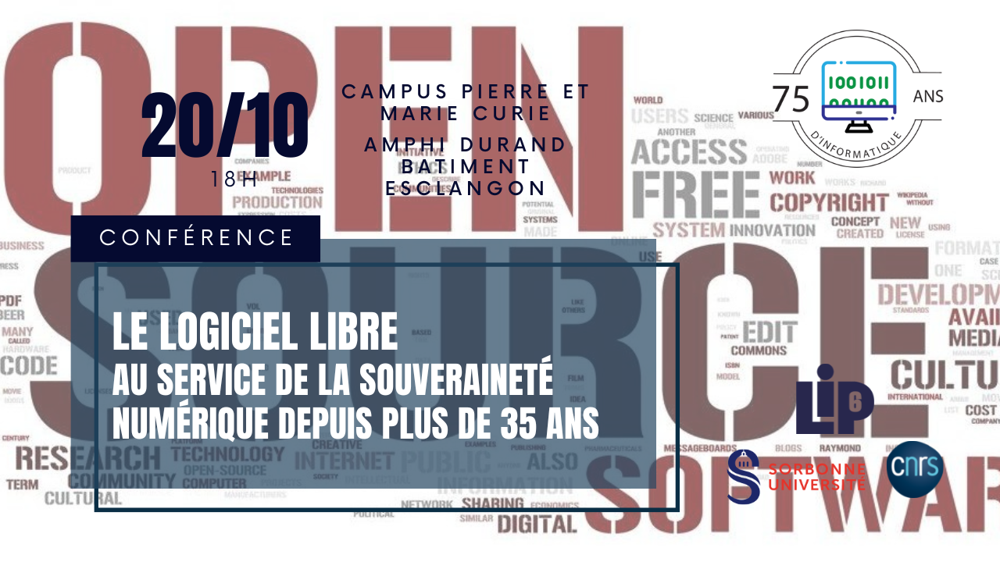

---

# Qui je suis

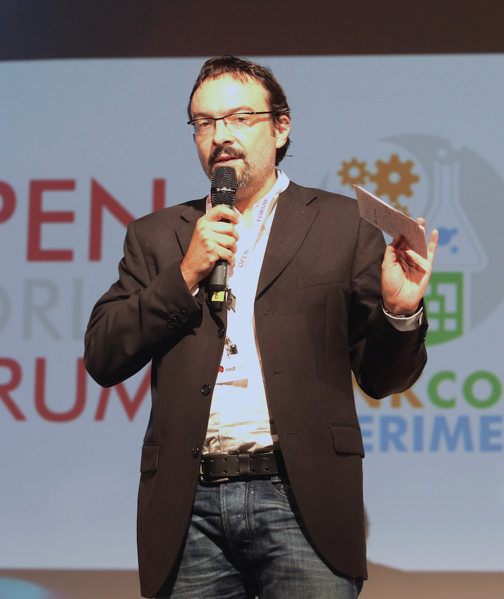

- **Stefane Fermigier**: entrepreneur français et activiste du logiciel libre et des libertés numériques.

- Fondateur et le PDG d'Abilian, éditeur open source (gestion d'information d'entreprise, cloud). Egalement enseignant à l'EPITA. 

- Précédemment: fondateur de Nuxeo (2000); enseignant-chercheur en mathématiques à l'Université Paris VII (1992-2000).

- Co-fondateur depuis 25 ans d'une demi-douzaines d'organisations dédiées à la promotion et à la défense du logiciel libre et du numérique ouvert, en France et en Europe, ainsi que de plusieurs conférences sur ces mêmes sujets.

---

# Citations "inspirantes"

---

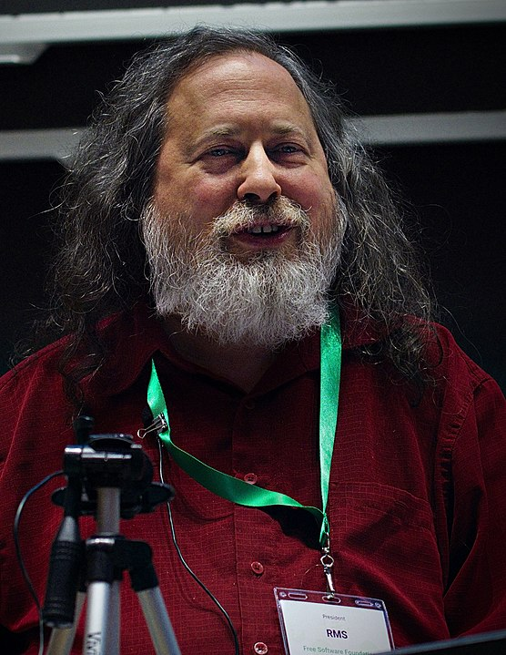

> "Liberté, Egalité, Fraternité"
-- Richard M. Stallman (RMS)

---

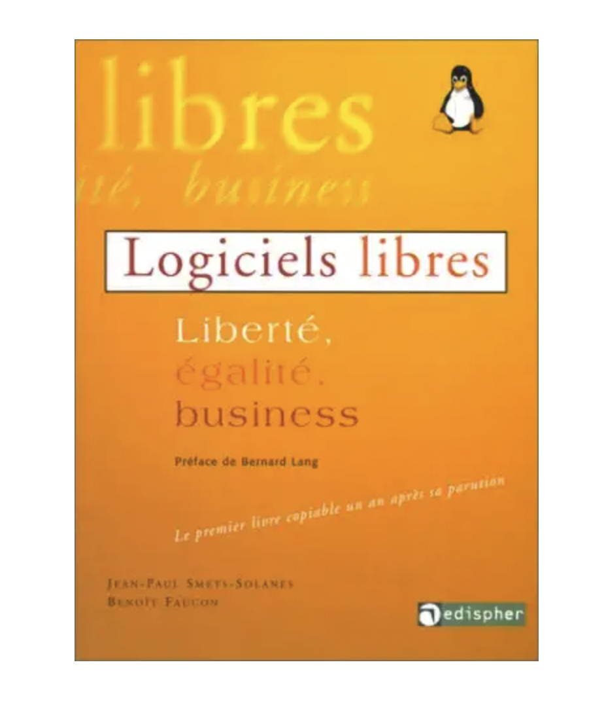

> "Liberté, égalité, business"
-- Jean-Paul Smets et Benoît Faucon (1999)

---

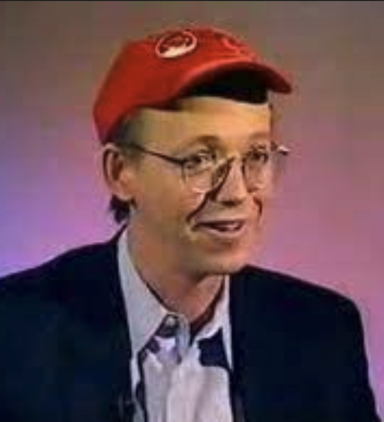

> “Freedom is not an abstract concept in business. The success of any industry is almost directly related to the degree of freedom the suppliers and the customers of that industry enjoy.”
--  Bob Young, (then) Chairman and CEO, Red Hat, Inc. (2001)

---

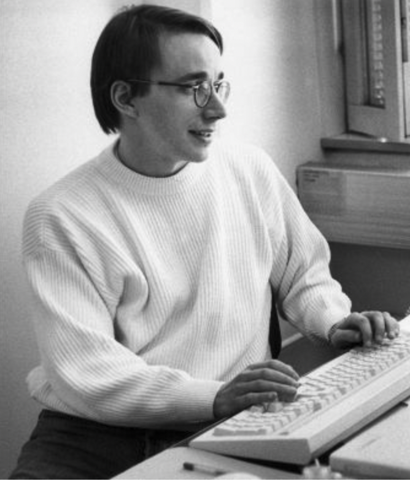

> “Talk is cheap. Show me the code.”
-- Linus B. Torvalds (2000)

---

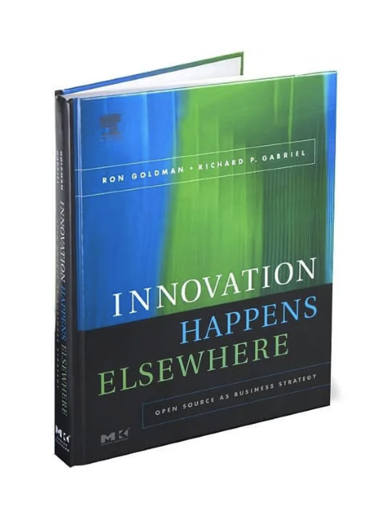

> "Innovation happens elsewhere"
-- Ron Goldman & Richard P. Gabriel (2005)

---

# Du logiciel libre...

---

# [fit] \(Contexte) Du mainframe au smartphone

 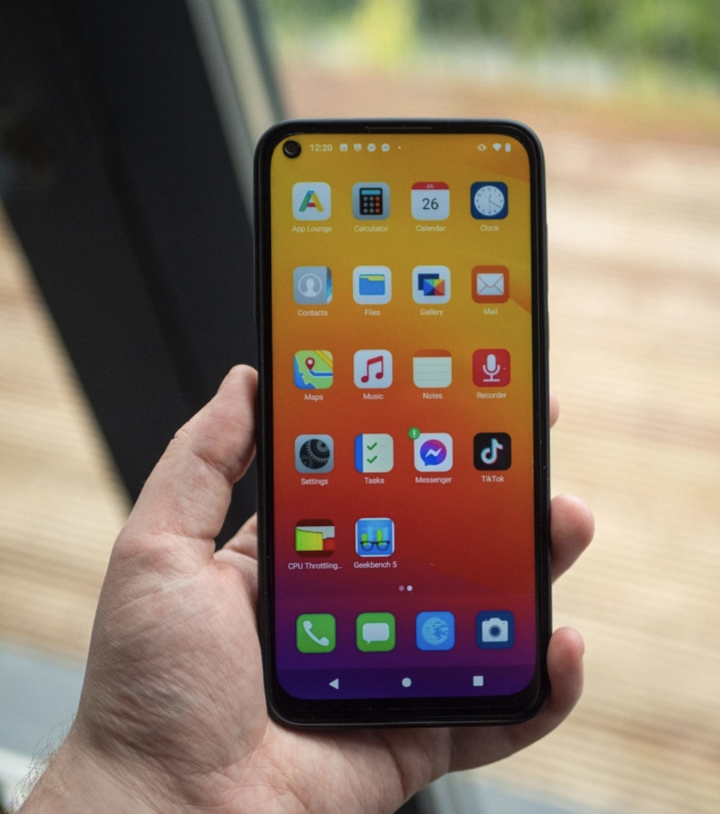

---

# [fit]Les grandes périodes de l'histoire du LL

- Années 50-60: Logiciel libre *de facto* et *ante litteram*
- Années 70: La proprietarisation du logiciel
- Années 70-80: Les briques et standards de base (Unix, X Window System, TCP/IP...)
- Années 80: Le matériel grand public devient suffisamment puissant pour des "vrais" OS (Intel 386+)
- Années 80: Richard Stallman, GNU et la Free Software Foundation
- Années 90: Linux, GNU/Linux, BSD, etc.: la prise de conscience
- Années 00: Professionalisation et expansion économique
- Années 10: Le libre comme accélérateur d'innovation et comme levier stratégique
- Années 20: A vous d'écrire l'histoire ?

---

# GNU Manifesto (Stallman, ~1983)

"GNU, which stands for Gnu's Not Unix, is the name for the complete Unix-compatible software system which I am writing so that I can give it away free to everyone who can use it."

"GNU will be able to run Unix programs, but will not be identical to Unix." 

"Unix is not my ideal system, but it is not too bad."

---

# GNU Manifesto (Stallman, ~1983)

"Several other volunteers are helping me. Contributions of time, money, programs and equipment are greatly needed."

"I consider that the Golden Rule requires that if I like a program I must share it with other people who like it."

"GNU is not in the public domain. Everyone will be permitted to modify and redistribute GNU, but no distributor will be allowed to restrict its further redistribution."

---

# Linus Benedict Torvalds (1991)

```
Newsgroups: comp.os.minix
From: torva...@klaava.Helsinki.FI (Linus Benedict Torvalds) Date: 25 Aug 91 20:57:08 GMT
Local: Sun 25 Aug 1991 21:57
Subject: What would you like to see most in minix?

Hello everybody out there using minix -

I’m doing a (free) operating system (just a hobby, won’t be big and professional like gnu) 
for 386(486) AT clones. This has been brewing since april, and is starting to get ready. 
I’d like any feedback on things people like/dislike in minix, as my OS resembles it somewhat
(same physical layout of the file-system (due to practical reasons) among other things).

I’ve currently ported bash(1.08) and gcc(1.40), and things seem to work. This implies
that I’ll get something practical within a few months, and I’d like to know 
what features most people would want.

Any suggestions are welcome, but I won’t promise I’ll implement them :-)
```

---

[.background-color: #fff]

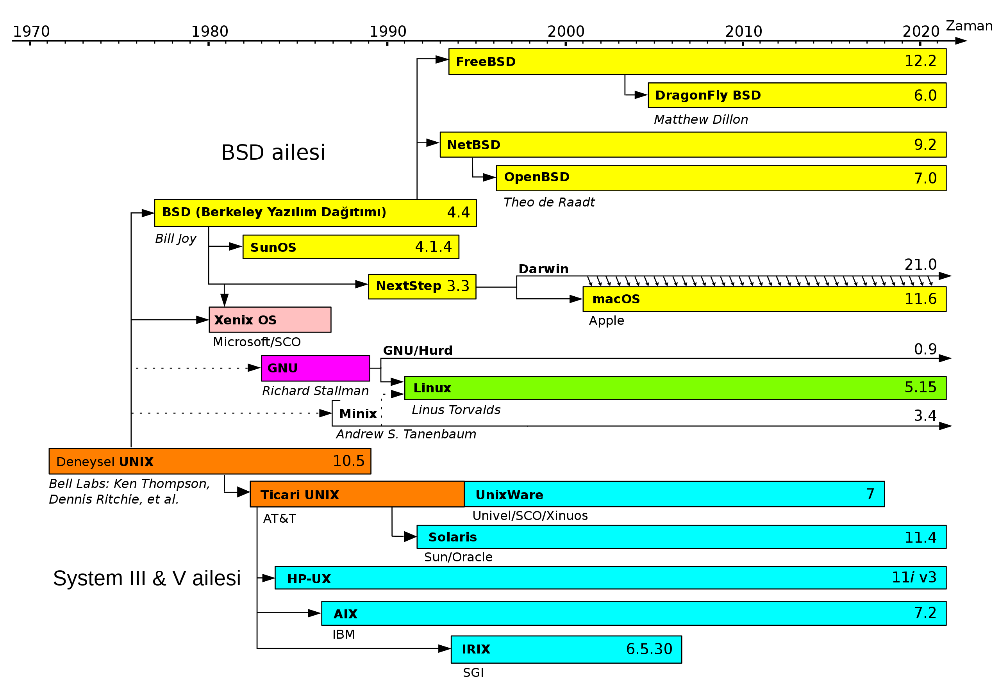

---

# Fondamentaux juridiques

Les conditions d'utilisation d'un logiciel sont régies par sa *licence*, qui repose sur le droit d'auteur ("copyright" en anglais).

La *licence* est un contrat de *mise à disposition* du logiciel (et non de cession de droits), qui est réputé "signé" par l'utilisateur lors de l'installation du logiciel.

Alors que le droit d'auteur est traditionnelles "restrictif", les licences libres visent à garantir des droits d'utilisation et de modification du logiciel. ("Hack" juridique).

Par définition, un logiciel est "libre" ssi sa licence répond à des critères acceptés par la communauté du logiciel libre.

---

# [fit]Les quatre libertés (définition FSF, 1986)

- la liberté de faire fonctionner le programme comme vous voulez, pour n'importe quel usage (liberté 0) ;
- la liberté d'étudier le fonctionnement du programme, et de le modifier pour qu'il effectue vos tâches informatiques comme vous le souhaitez (liberté 1) ; l'accès au code source est une condition nécessaire ;
- la liberté de redistribuer des copies, donc d'aider les autres (liberté 2) ;  
- la liberté de distribuer aux autres des copies de vos versions modifiées (liberté 3) ; en faisant cela, vous donnez à toute la communauté une possibilité de profiter de vos changements ; l'accès au code source est une condition nécessaire.

---

# Historique des licences libres

OSI: "The following OSI-approved licenses are popular, widely used, or have strong communities:"

[.column]
- 1987: MIT
- 1988: (proto-)BSD
- 1989: GPL v1
- 1990: BSD "4-clause"
- 1991: GPL v2, LGPL ("v2")
- 1998: Mozilla Public License 1.0

[.column]
- 1999: BSD "3-clause" et "2-clause"
- 2004: Apache 2.0
- 2004: CDDL
- 2007: GPL v3, LGPL v2.1
- 2012: Mozilla Public License 2.0
- 2017: Eclipse Public License 2.0

---

[.background-color: #fff]

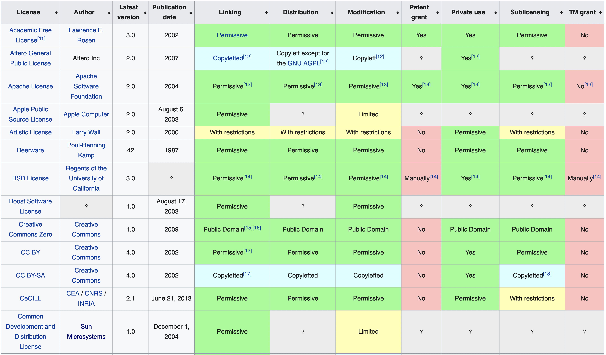

---

# ... à l'open source

---

# 1998 - L'année où tout bascule

Jan. 1998: Netscape annonce le passage de Navigator en libre 
Fev. 1998: Peterson, Raymond, etc. créent le terme “open source”
Mar. 1998: Netscape ouvre le code
Mar. 1998: fondation de l'AFUL en France
Jul. 1998: Debian 2.0: 300 contributeurs, 1,500 paquets
Jul. 1998: KDE 1.0 sort
Jul. 1998: Linux Mandrake (Gael Duval)
Aou. 1998: Linus Torvalds fait la couverture de Forbes Magazine
Oct. 1998: IBM porte Apache sur les AS/400
Oct. 1998: Intel et Netscape investissent dans Red Hat
Nov. 1998: “Halloween” documents (MS entre en guerre contre Linux)

---

# Contexte et motivations (1998)

L'expression « open source » est apparue en 1998, lors d'une réunion tenue à Palo Alto, en Californie, en réaction à l'annonce faite par Netscape en janvier 1998 de la publication du code source de Navigator.

Linus Torvalds a apporté son soutien le lendemain, et Phil Hughes a soutenu le terme dans le Linux Journal. Richard Stallman, semblait initialement adopter le terme, mais a ensuite changé d'avis.

Parmi les motivations: «*free*» possède deux significations en anglais, «libre» et «gratuit». Cette nouvelle désignation permet lever l'ambiguité avec le terme, populaire à l'époque, de "*Freeware*" ("graticiel") et de ne pas contrarier l'émergence de *business models* lucratifs autour du logiciel libre.

---

# [fit]1999 L'Open Source Definition (OSD)

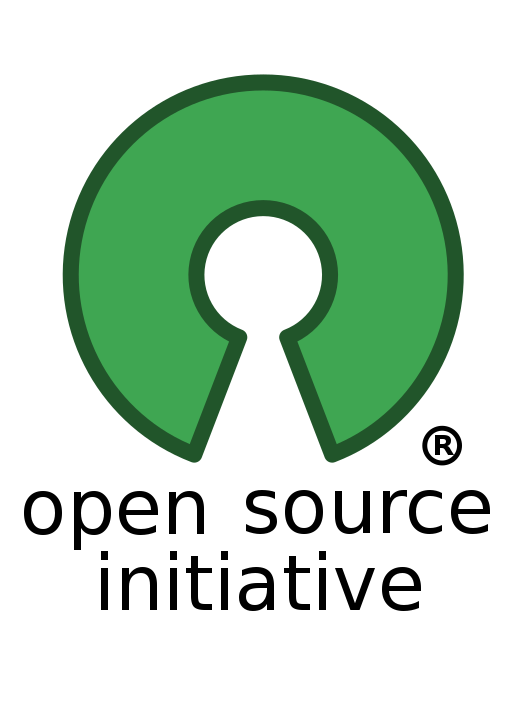

[.build-lists: false]

1. Redistribution libre
2. Code source
3. Travaux dérivés
4. Intégrité du code source de l'auteur
5. Pas de discrimination contre les personnes ou les groupes
6. Absence de discrimination dans les domaines de compétence
7. Distribution de la licence
8. La licence ne doit pas être spécifique à un produit
9. La licence ne doit pas restreindre d'autres logiciels
10. La licence doit être neutre sur le plan technologique

 Source: <https://opensource.org/osd>

---

# [fit]Positionnements != (ou pas ?)

<!-- 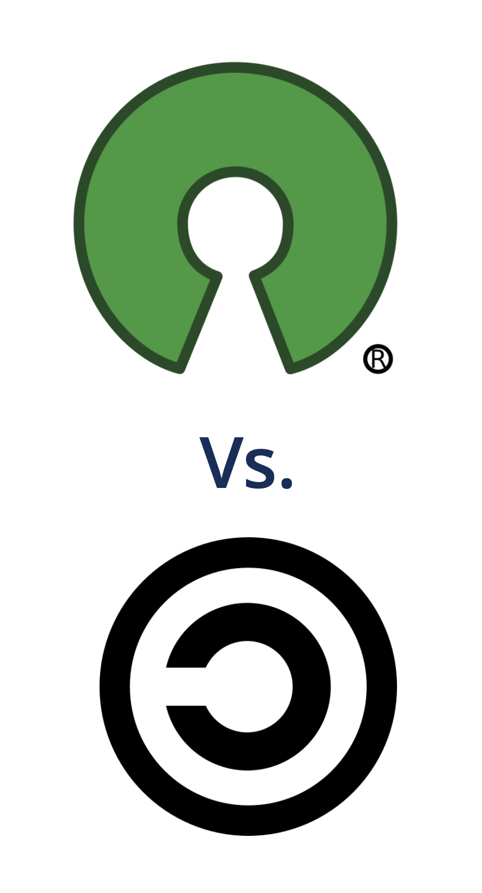 -->

> “Open source is a development method for software that harnesses the power of distributed peer review and transparency of process. The promise of open source is better quality, higher reliability, more flexibility, lower cost, and an end to predatory vendor lock-in.”
-- OSI
<br>
> "Open source *is* free software. Open source started as a marketing program for free software back in 1998."
-- Simon Phipps, President of OSI (2018)

---

[.background-color: #fff]

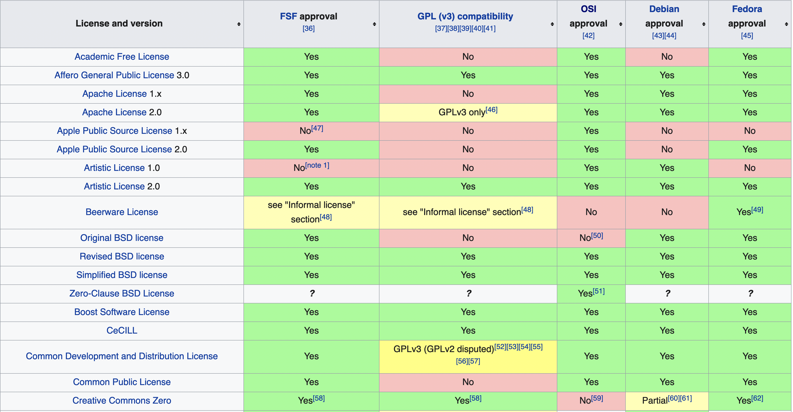

---

# Explosion du business depuis 1999

1999: fondation de MandrakeSoft, qui deviendra Mandriva en 2005 et fermera en 2015
1999: Marc Fleury démarre EJB-OSS, serveur J2EE qui deviendra JBoss
1999: IPO de Red Hat (5 Mrd de $ pour 11 M$ de CA) et de VA Linux
2000: IBM “investit” 1 Mrd de dollars dans Linux
2004: fondation de Canonical (Ubuntu)
2006: rachat de JBoss par Red Hat pour 350 M de $
2007: Java devient open source (*with strings attached*)
2008: rachat de MySQL par Sun pour 1 Mrd de $
2009: proche de la faillite, Sun Microsystems est racheté par Oracle
2017: rachat de GitHub par Microsoft pour 7 Mrd de $
2019: rachat de Red Hat par IBM pour 34 Mrds de $
2021: IPO de Gitlab (15 Mrds de $ de capitalisation)

---

[.background-color: #fff]

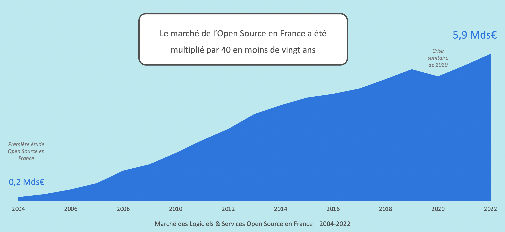

---

[.background-color: #fff]

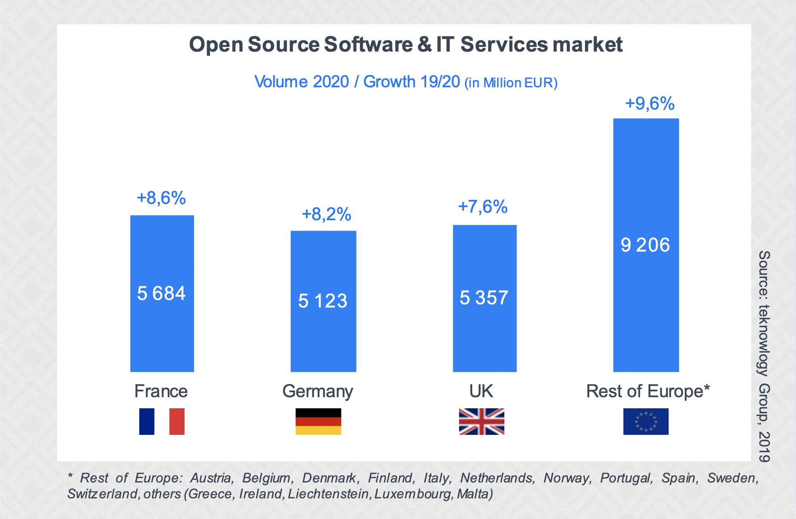

---

# Un impact économique majeur

D'après une étude de la Commission européenne de 2021:

- En 2018, dans tous les États membres de l'UE, l'impact économique des logiciels libres était compris entre 65 et 95 milliards d'euros.
- Une augmentation de 10 % des contributions au code des logiciels libres générerait annuellement en Europe un gain de PIB de 0,4 % à 0,6 %.
- Les investissements dans les logiciels libres engendrent un retour sur investissement estimé entre 1:4 et 1:10.

---

# Production et contribution

---

# Quels modèles économiques pour pérenniser la croissance du LL ?

- Entreprises (ENL)
  - Edition
  - Service (principalement intégration)
  - Hybrides
- Non-lucratifs

---

# Les éditeurs de logiciel libre

- Un éditeur est responsable du cycle de vie d'un ou plusieurs logiciels (conception, développement, maintenance...)
- Ainsi que de sa mise sur le marché (marketing, commercialisation, distribution, support...)
- Diversité des modèles, selon le domaine visé (infrastructures, outils de développement, applicatifs...) et le marché (B2B, B2G, B2C...)
- Emergence du SaaS (i.e. abonnement à des services, notamment cloud) comme modèle principal de revenu

---

# Les sociétés de service

- S'appuient sur des logiciels libres développés par des tiers (éditeurs, "fondations", individus...)
- Servies proposés: conseil, intégration, formation, support, maintenance, hébergement...
- Peuvent être des "pure players" (ESNL) ou des généralistes (ESN, ex-SSII)
- Certaines (beaucoup en fait) société de services ont en parallèle ou s'appuient sur une activité d'édition (modèle "VAR" notamment)

---

# Les "fondations"

Organisations à but non lucratif qui soutiennent un ou plusieurs projets open source, en fournissant, suivant les cas:

- un cadre juridique
- des processus et des outils de collaboration et de gouvernance
- des moyens techniques, humains et/ou financiers

---

# Les grandes fondations

1985: FSF
1997: KDE e.V.
1999: Apache Foundation
2000: Linux Foundation (fusion de l'Open Source Development Labs du Free Standards Group)
2001: FSFE
2001: Python Software Foundation
2004: Eclipse Foundation
2007: OW2 (Fusion de ObjectWeb et OrientWare)
2010: Document Foundation (LibreOffice)

---

# Open science

- Historiquement, de nombreux défenseurs du logiciel libre ont utilisé l'analogie entre le développement de la science et celui du logiciel libre: libre circulation des idées, "shoulder of giants", etc.

- Aujourd'hui, c'est le logiciel libre qui inspire le mouvement de la "science ouverte":

  - "La diffusion sans entrave des résultats, des méthodes et des produits de la recherche scientifique. Elle s’appuie sur l’opportunité que représente la mutation numérique pour développer l’accès ouvert aux publications et – autant que possible – aux données, aux codes sources et aux méthodes de la recherche."

  - Cf. le "[Plan national pour la science ouverte](https://www.ouvrirlascience.fr)", qui prévoit notamment d' "ouvrir et promouvoir les codes sources produits par la recherche".

---

# Métiers du logiciel libre

- Développement (en édition ou en service / intégration)
- Support, conseil
- Sysadmin, "devops"
- Conseil, expertise (techniques ou non)
- Marketing (incl. DevRel)
- Gouvernance (cf. OSPO)

---

# Souveraineté numérique et logiciel libre

---

# Loi Lemaire, 2016


> "Les administrations [...] veillent à préserver la maîtrise, la pérennité et l’indépendance de leurs systèmes d’information.
-- *Article 16 de la loi "pour une république numérique"*

---

# [fit] Ministère des armées, 2018


> "La souveraineté numérique peut être entendue comme la capacité [...] d'agir de manière souveraine dans l'espace numérique, en y conservant une **capacité autonome d'appréciation, de décision et d'action** [...] La souveraineté numérique ne représente donc pas la volonté de tout faire en national ce qui serait synonyme de replis sur soi mais bien de conserver **une autonomie et une liberté de choix**."
-- Secrétariat de la défense et de la sécurité nationale, Revue stratégique de cyberdéfense, 2018

---

# Rapports parlementaires

- Morin-Desailly: 2014
- Longuet: 2019
- Latombe: 2021

---

# Rapport Latombe (2021)

"Une politique de souveraineté numérique ne peut être envisagée qu’en conjuguant trois dimensions essentielles :

– une approche **juridique**, pour garantir un cadre protecteur des droits et libertés des citoyens, et réguler l’action des grands acteurs ;
– une approche **économique** pour stimuler le potentiel d’innovations des acteurs nationaux et encourager la constitution d’écosystèmes compétitifs ;
– et, enfin, une approche **libérale ou citoyenne**, qui mobilise les citoyens en les sensibilisant aux enjeux politiques de leurs usages."

---

## Cloud souverain ou "cloud de confiance" ?

**Souveraineté du cloud = souveraineté des données + automomie technologique**

- Menaces:

  - Lois extraterritoriales (notamment US): CLOUD ACT, FISA - qui s'appliquent aux entreprises et aux citoyens européens et français

  - L'omnipotence des GAFAM / "hyperscalers non-européens"

- Les solutions purement juridiques (ex: RGPD, "cloud de confiance") ne suffisent pas

  - Safe harbor, Schrems I, Privacy Shield, Schrems II, accord "gaz contre données", etc.

  - Masquarade du Health Data Hub...

---

# Propositions du rapport Latombe

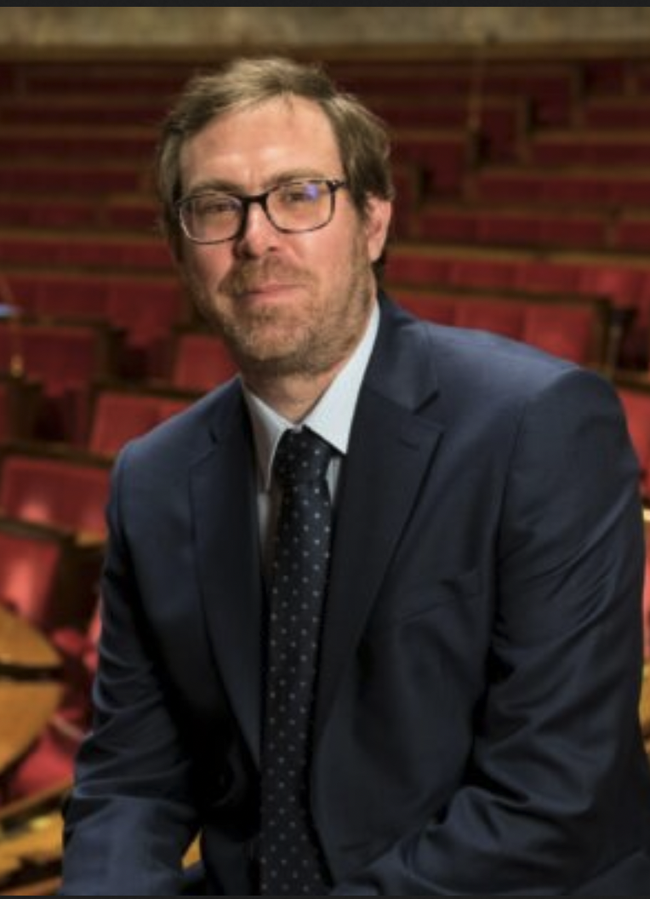

"Il s’agit, en effet, de réduire la part des solutions logicielles propriétaires, notamment non européennes, utilisées par défaut alors que des solutions alternatives ont fait la démonstration de leur utilité.

- Proposition n° 52 : Imposer au sein de l’administration le recours systématique au logiciel libre, en faisant de l’utilisation de solutions propriétaires une exception.
- Proposition n° 26 : Privilégier, en matière de commande publique, le recours aux solutions d’acteurs technologiques français ou européens."

---

# Politiques de soutien

---

# [fit]Jean-Marc Ayrault, 2012

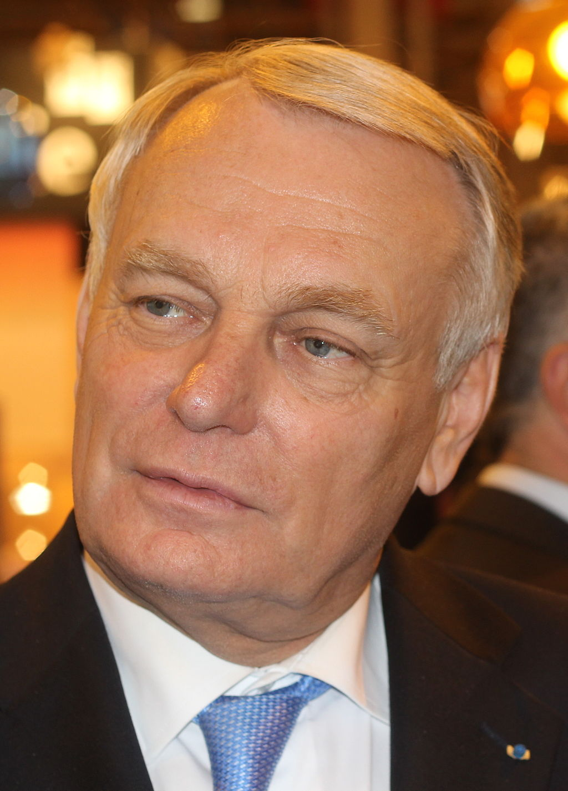

> "Les logiciels libres sont des logiciels dont le modèle de propriété intellectuelle est conçu pour donner à l’utilisateur une grande liberté d’utilisation, de modification et de diffusion. Ils couvrent un domaine d’emploi très large, à la fois dans les entreprises privées et dans les administrations."
-- *Circulaire interministérielle “Orientations pour l'usage des logiciels libres dans l’administration”*

---

# Loi Lemaire, 2016


> "Les administrations [...] veillent à préserver la maîtrise, la pérennité et l’indépendance de leurs systèmes d’information. **Elles encouragent l’utilisation des logiciels libres et des formats ouverts** lors du développement, de l’achat ou de l’utilisation, de tout ou partie, de ces systèmes d’information."
-- *Article 16 de la loi "pour une république numérique"*

---

# [fit] Ministère des armées, 2018


> "Une stratégie industrielle basée sur l’open source, sous réserve qu’elle s'inscrive dans une démarche commerciale réfléchie, peut permettre aux industriels français ou européens de gagner des parts de marché où ils sont aujourd’hui absents et par là même de permettre à la France et à l’Union européenne de reconquérir de la souveraineté."
-- *Revue stratégique de cyberdéfense, 2018*

---

# OSPO

Beaucoup de grandes organisations (grands groupes, administrations, universités...) ont maintenant compris les bénéfices à tirer, ainsi que les responsabilités, liés à l'utilisation et à la production de logiciel libres, ainsi qu'à l'interactions avec des écosystèmes open source externes.

Emerge à présent la nécessité de mettre en place des structures organisationnelles dédiées à la gestion de ces activités: les OSPO (Open Source Program Offices).

C'est le cas, depuis maintenant quelques années, avec une montée en puissance graduelle, des administrations françaises et européennes.

---

# Commission européenne (2020)

- "Les solutions «open source» seront privilégiées lorsqu’elles sont équivalentes en matière de fonctionnalités, de coût total et de cybersécurité.
- Nous exploitons les principes de travail du code source ouvert; nous innovons et cocréons, partageons et réutilisons, et construisons ensemble des services publics centrés sur l’utilisateur et fondés sur les données.
- Nous partageons notre code et rendons possible les contributions incidentes aux projets à code source ouvert associés.
- Nous nous efforçons d’être un membre actif de l’écosystème diversifié du code source ouvert.
- Nous nous assurons que le code que nous utilisons et le code que nous partageons sont exempts de failles en appliquant des tests de sécurité continus.
- Nous encourageons des normes et spécifications ouvertes qui sont mises en œuvre et diffusées selon le principe du code source ouvert."

-- Communication à la Commission - Stratégie en matière de logiciels libres 2020 – 2023 "L'esprit ouvert" - C(2020) 7149 final

---

# France: Plan d’action logiciels libres et communs numériques (2021)

- "Mieux connaître, utiliser et concevoir les logiciels libres et les communs numériques"
- "Développer et accompagner l’ouverture et la libération des codes sources"
- "S’appuyer sur les logiciels libres et open source et les communs numériques pour renforcer l’attractivité de l’État-employeur auprès des talents du numérique"

La mise en oeuvre de ce plan est confiée au pôle logiciels libres d'Etalab, au sein de la DINUM (dirigé par Bastien Guerry).

---

## Europe - Déclaration de Strasbourg (2022)

"Les ministres chargés de l’administration, la transformation et la fonction publiques, avec le soutien de la Commission européenne, déclarent leur intention [...] De promouvoir les logiciels open source au sein des administrations publiques ainsi que leur partage, en :

- Reconnaissant le rôle majeur joué par les solutions open source sécurisées dans la transformation des administrations publiques, qui permettent de mutualiser les investissements entre de multiples organisations, offrent une transparence et une interopérabilité par défaut et garantissent une maîtrise sur les technologies utilisées ainsi qu’une plus grande indépendance technologique ;
- tirant parti des solutions open source pour renforcer la collaboration entre les administrations publiques [...];
- promouvant une redistribution équitable de la valeur créée par les solutions libres, notamment pour ceux qui produisent et partagent du code source ouvert."

---

# Education / formation

Besoin, au sein de la filière du LL en France, d'environ 5000 nouveaux spécialistes du LL par an d'ici à 2027.

Ce besoin ne prend pas en compte les profils "logiciels libres" chez les utilisateurs, qui sont également concernés.

A ce stade, très peu de formations dédiées ou de cours spécifiques sont proposés dans les écoles et les universités.

---

# Conclusion / questions ouvertes

---

# Le libre a-t-il gagné ?

[.background-color: #000]


---

# Le libre a-t-il gagné ?

- En tant que produit: en partie
  - Linux et BSD en tant que noyaux
  - OS complets: nombreux marchés mais pas le desktop + ambiguités
  - Cf. Torvalds ("La qualité de Linux sur ARM s'est considérablement améliorée quand j'ai reçu un portable avec processeur ARM")
  - Navigateurs Web: oui et non
  - Cloud: oui et non
- Impact économique: direct = 10% de l'informatique / indirect = énorme ?

---

# Que puis-je faire ?

- Continuer à s'éduquer
  - En contribuant aux logiciels libres, si le contexte est favorable
- Agir selon son éthique personnelle
  - En tenant compte de dynamiques collectives

---

# Questions ouvertes

- Libre et GAFAM ?
- En particulier libre et cloud ?
- Libre et IA ?
- Libre et (biens) communs numériques ?
- Inclusivité (notamment participation des femmes) ?
- Libre et numérique éthique / responsable ?

---

# Fin

---

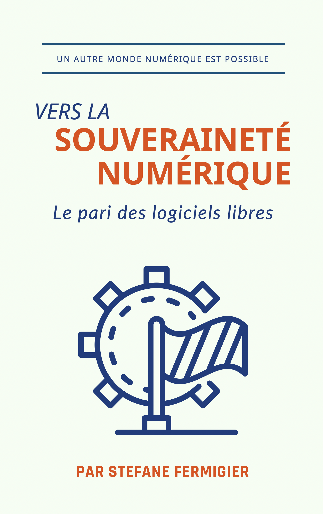

# Merci !

- <https://fermigier.com/>
- <https://souverainete.net/> ---------->

## Prochains événements

- Track souveraineté lors de l'Open Source Experience (OSXP), les 8 et 9 nov.
- Journée souveraineté de la Société Informatique de France (SIF), le 22 nov.
