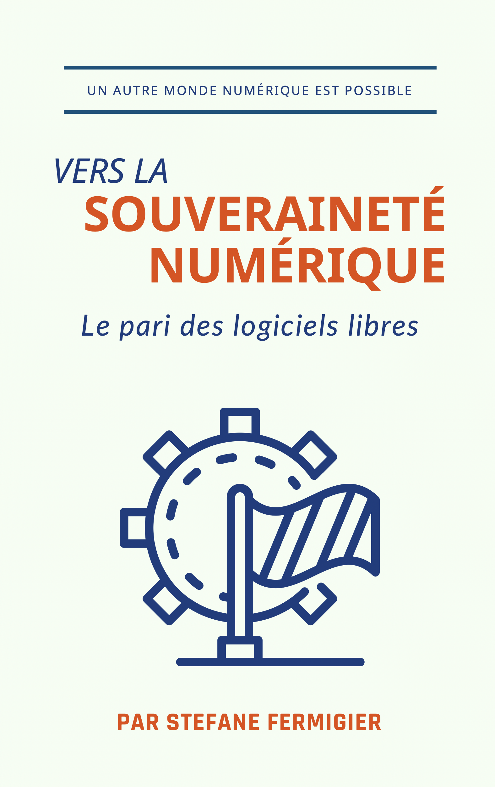
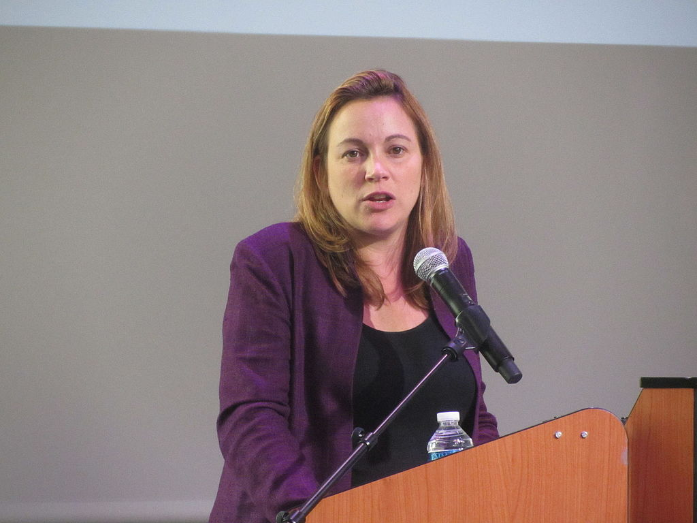
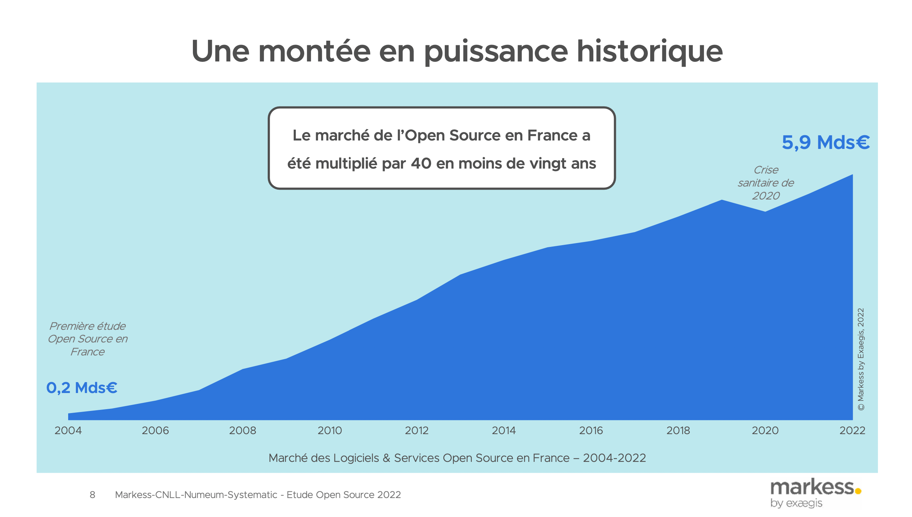

autoscale: true
slide-transition: true
<!-- build-lists: true -->
<!-- slidenumbers: true -->

# Souveraineté numérique: le pari du logiciel libre

---

# [fit] Ministère des armées, 2018

> "La souveraineté numérique peut être entendue comme la capacité [...] d'agir de manière souveraine dans l'espace numérique, en y conservant une **capacité autonome d'appréciation, de décision et d'action** [...] La souveraineté numérique ne représente donc pas la volonté de tout faire en national ce qui serait synonyme de replis sur soi mais bien de conserver **une autonomie et une liberté de choix**."
-- Secrétariat de la défense et de la sécurité nationale, Revue stratégique de cyberdéfense, 2018

---

# Loi Lemaire, 2016

> "Les administrations [...] veillent à préserver la maîtrise, la pérennité et l’indépendance de leurs systèmes d’information.
-- *Article 16 de la loi "pour une république numérique"*

---

# [fit] Souveraineté numérique vs. "numérique de confiance" ?

**Souveraineté numérique = souveraineté des données + automomie technologique**

- Exemples de menaces:

  - Lois extraterritoriales (notamment US): CLOUD ACT, FISA - qui s'appliquent aux entreprises et aux citoyens européens et français

  - L'omnipotence des GAFAM / "hyperscalers non-européens"

- Les solutions purement juridiques (ex: RGPD, "cloud de confiance") ne suffisent pas:

  - Safe harbor (1998) ➜ Schrems I (2015) ➜ Privacy Shield (2016) ➜ Schrems II (2020) ➜ accord "gaz contre données" (2022), etc.

  - Masquarade du Health Data Hub...

---

# Rapports parlementaires

- Morin-Desailly: 2014
- Longuet: 2019
- Latombe: 2021

---

# Rapport Latombe (2021)

"Une politique de souveraineté numérique ne peut être envisagée qu’en conjuguant trois dimensions essentielles :

– une approche **juridique**, pour garantir un cadre protecteur des droits et libertés des citoyens, et réguler l’action des grands acteurs ;
– une approche **économique** pour stimuler le potentiel d’innovations des acteurs nationaux et encourager la constitution d’écosystèmes compétitifs ;
– et, enfin, une approche **libérale ou citoyenne**, qui mobilise les citoyens en les sensibilisant aux enjeux politiques de leurs usages."

---

# Propositions du rapport Latombe

"Il s’agit, en effet, de réduire la part des solutions logicielles propriétaires, notamment non européennes, utilisées par défaut alors que des solutions alternatives ont fait la démonstration de leur utilité.

- Proposition n° 52 : Imposer au sein de l’administration le recours systématique au logiciel libre, en faisant de l’utilisation de solutions propriétaires une exception.
- Proposition n° 26 : Privilégier, en matière de commande publique, le recours aux solutions d’acteurs technologiques français ou européens."

---

# Logiciel libre FTW ?

[.background-color: #000]

---

# Loi Lemaire, 2016

> "Les administrations [...] veillent à préserver la maîtrise, la pérennité et l’indépendance de leurs systèmes d’information. **Elles encouragent l’utilisation des logiciels libres et des formats ouverts** lors du développement, de l’achat ou de l’utilisation, de tout ou partie, de ces systèmes d’information."
-- *Article 16 de la loi "pour une république numérique"*

---

# [fit] Ministère des armées, 2018

> "Une stratégie industrielle basée sur l’open source, sous réserve qu’elle s'inscrive dans une démarche commerciale réfléchie, peut permettre aux industriels français ou européens de gagner des parts de marché où ils sont aujourd’hui absents et par là même de permettre à la France et à l’Union européenne de reconquérir de la souveraineté."
-- *Revue stratégique de cyberdéfense, 2018*

---

---

# Commission européenne (2020)

- "Les solutions «open source» seront privilégiées lorsqu’elles sont équivalentes en matière de fonctionnalités, de coût total et de cybersécurité.
- Nous exploitons les principes de travail du code source ouvert; nous innovons et cocréons, partageons et réutilisons, et construisons ensemble des services publics centrés sur l’utilisateur et fondés sur les données.
- Nous nous assurons que le code que nous utilisons et le code que nous partageons sont exempts de failles en appliquant des tests de sécurité continus.
- Nous encourageons des normes et spécifications ouvertes qui sont mises en œuvre et diffusées selon le principe du code source ouvert."

-- Communication à la Commission - Stratégie en matière de logiciels libres 2020 – 2023 "L'esprit ouvert" - C(2020) 7149 final

---

# [fit]Déclaration de Strasbourg (juin 2022)

- Les ministres de la fonction publique des Etats membres s'engagent à promouvoir les logiciels open source au sein des administrations publiques en leur reconnaissant de nombreux atouts : mutualisation des investissements, transparence, interopérabilité, **indépendance technologique**, collaboration entre états-membres.

---

# [fit]Interoperable Europe Act (novembre 2022)

- "L'open source permet aux utilisateurs d'évaluer et d'inspecter activement **l'interopérabilité et la sécurité des solutions**, les utilisateurs sont donc **autonomes et indépendants** dans la gestion de leurs propres infrastructures **sans contraintes externes**.
- En outre, **elle atténue les risques de cybersécurité et les effets de verrouillage** qui peuvent être traités en utilisant une approche coordonnée entre les États membres.
- Le déploiement de stratégies de sources ouvertes a des effets d'entraînement positifs sur l'efficacité de **l'innovation** et sur l'Union.
- L'open source et les standards ouverts sont des facteurs d'interopérabilité."

---

# Merci !

- <https://fermigier.com/>
- <https://souverainete.net/> --->
