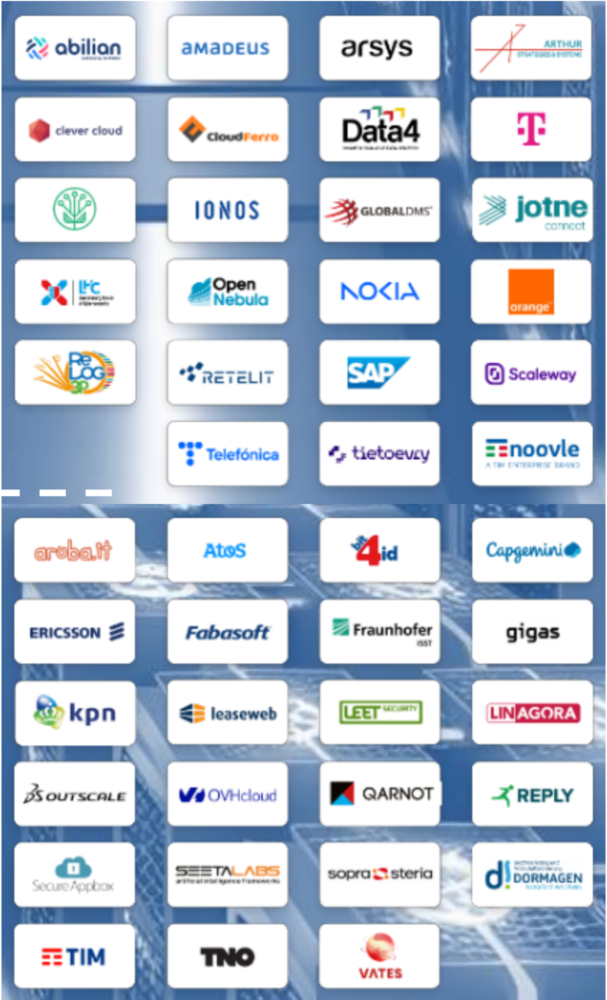

<!--
class:
 - lead
-->

### ***The Open Source Way to EU Digital  Sovereignty & Competitiveness***

### Une feuille de route pour l'action

<i>Stefane Fermigier, Founder & CEO, Abilian SAS</i>

---

# **Souveraineté numérique ?**

**"Capacité d'appréciation, de décision et d'action autonome dans l'espace numérique.**

[...]

**Une stratégie industrielle basée sur l’open source**, sous réserve qu’elle s'inscrive dans **une démarche commerciale réfléchie**, peut permettre aux industriels français ou européens de gagner des parts de marché où ils sont aujourd’hui absents et par là même de permettre à la France et à l’Union européenne de reconquérir de la souveraineté."

-- Revue annuelle de Cyberdéfense, SGDSN, 2018

---

# **Un malentendu courant**

"L'Europe a reconnu l'impératif d'atteindre une véritable souveraineté numérique et technologique [...] Cela nécessite non seulement le contrôle des données, mais aussi le contrôle des technologies sous-jacentes - matériel et logiciel - qui traitent, stockent et gèrent ces données." 
-- The Open Source Way to EU Digital Sovereignty & Competitiveness

Pour simplifier:

<b>Souveraineté Numérique = Souveraineté des Données + Autonomie Technologique</b>

---

# **L'Open Source : un impératif stratégique**

Plus qu'une simple question de coût, l'Open Source est un fondement de la **souveraineté technologique**.

-   **Transparence & sécurité**
    Le code est auditable par tous, permettant de vérifier l'absence de portes dérobées et de corriger les failles collectivement.
-   **Autonomie & réversibilité**
    Échapper à l'enfermement propriétaire (*vendor lock-in*). La maîtrise du code garantit la liberté d'agir, d'adapter et d'innover. **"Rester par choix, non par contrainte"**.
-   **Collaboration & innovation**
    Mutualiser les efforts pour construire les briques technologiques de pointe que personne ne pourrait développer seul.

---

# **Une ambition européenne partagée**

La souveraineté numérique est un impératif stratégique pour l'Europe, portée par un écosystème d'acteurs engagés :

-   **Acteurs industriels & associatifs**
    -   -> **European Alliance for Industrial Data, Edge and Cloud**
    -   Aussi: APELL, EuroStack, OW2, Eclipse Foundation, etc.

-   **Programmes stratégiques de la Commission européenne**
    -   Next Generation Internet (NGI) -> Open Internet Stack (OIS)
    -   IPCEI-CIS (Cloud Infrastructure and Services)

**Objectif commun :** Bâtir une infrastructure numérique compétitive, résiliente, et alignée avec nos valeurs.

---

## **L'Alliance pour les Données Industrielles, l'Edge et le Cloud**

-   **Qui ?** Une initiative de la Commission Européenne qui rassemble des entreprises (PME, grands groupes), les États membres et des experts.

-   **Mission ?** Renforcer la position de l'industrie européenne sur le cloud et l'edge. Définir des feuilles de route d'investissement et de développement technologique.

- **57 membres industriels** à ce jour. La France y est déjà bien représentée, mais nous devons y être encore plus actifs pour porter nos ambitions !

---

## **Une feuille de route Open Source pour l'Europe (juillet 2025)**

4 motivations clés:

-   **Souveraineté :** Contrôler notre infrastructure et réduire la dépendance technologique.

-   **Sécurité :** Protéger les données et garantir la conformité avec nos lois (RGPD, NIS 2...).

-   **Innovation :** Stimuler un marché compétitif et collaboratif, en soutenant nos PME.

-   **Durabilité :** Réduire l'empreinte environnementale de notre écosystème numérique.

---

# **Feuille de route (suite)**

**5 "gaps" critiques** qui freinent notre souveraineté :

1.  Manque de standards ouverts et d'interopérabilité
2.  Sous-investissement dans les briques logicielles critiques
3.  Barrières à l'adoption (marché, compétences)
4.  Pénurie de talents et de formations
5.  Gouvernance des projets souvent hors de l'UE

=> **70 actions concrètes**, pour transformer ces défis en opportunités.

---

## **5 piliers stratégiques pour 70 propositions**

- **Développement technologique**
  Bâtir notre socle technologique sur des standards ouverts et interopérables.

- **Développement des compétences**
  Former les talents pour construire et maintenir notre écosystème souverain.

- **Commande publique**
  Utiliser la puissance de l'achat public comme levier de changement.

- **Croissance et investissement**
  Créer un écosystème de financement durable pour nos projets Open Source.

- **Gouvernance**
  Assurer la pérennité, la sécurité et le contrôle européen des projets critiques.

---

## **Gap 1 : Standards ouverts & interopérabilité effective**

**Le problème** : Notre écosystème est fragmenté par de "faux" standards ouverts, promus par des acteurs non-UE comme une façade (*open washing*) pour maintenir leur domination et bloquer la concurrence.

**Solutions industrielles :**

1.  **Définir et n'utiliser que des standards VRAIMENT ouverts**
    -   Creer des **spécifications** libres de toute restriction, développées et gouvernées par des entités européennes et des **architectures de référence** basées sur ces standards et sur des briques Open Source "européennes".

2.  **Lancer des projets pilotes collaboratifs**
    -   Co-investir pour **démontrer la viabilité** technique et économique de ces standards communs, créant ainsi un effet d'entraînement sur le marché.

---

## **Gap 2 : Financement précaire & manque de Viabilité**

**Le problème** : Beaucoup de projets Open Source critiques dépendent d'un financement sporadique et du bénévolat, ce qui les rend instables et non compétitifs.

**Solutions industrielles :**

1.  **Développer des offres commerciales stratégiques**
    -   Bâtir des offres commerciales à forte valeur ajoutée autour de l'Open Source : **support expert, hébergement cloud, consulting**, et versions "entreprise".

2.  **Structurer l'engagement via des OSPOs**
    -   Créer des **Open Source Program Offices**, notamment dans les grands groupes (cf. TOSIT en France), pour professionnaliser les contributions, maximiser le retour sur investissement et influencer activement les projets clés.

---

## **Gap 3 : Domination marketing & manque de visibilité**

**Le problème** : Les solutions européennes sont invisibles, étouffées par les narratifs marketing dominants des acteurs non-UE qui sèment le doute.

**Solutions industrielles :**

1.  **Créer un label industriel de confiance**
    -   Lancer un label ou une certification **"European Sovereign Open Source"** gérée par l'industrie, garantissant la qualité, la sécurité et l'alignement avec les intérêts européens.

2.  **Mener un marketing collectif et unifié**
    -   Avec les associations professionnelles, **publier des *success stories***, organiser des événements et créer un narratif puissant autour de l'excellence européenne.

---

## **Gap 4 : Pénurie de talents & de compétences**

***Le problème*** : Le manque d'expertise en technologies Open Source ralentit l'innovation et nous rend dépendants de l'expertise étrangère.

**Solutions industrielles :**

1.  **Développer des formations et certifications**
    -   Créer des cursus **reconnus par l'industrie** pour former et certifier des experts sur les technologies souveraines, répondant ainsi directement aux besoins du marché.

2.  **Bâtir des partenariats stratégiques avec le monde académique**
    -   Financer des chaires de recherche, proposer stages et alternances, intervenir dans les formation, etc., pour repérer et recruter les meilleurs talents de demain.

---

## **Gap 5 : Faible influence dans la gouvernance**

**Le problème** : L'Europe contribue beaucoup aux projets Open Source, mais exerce peu de contrôle sur leur direction stratégique, souvent décidée ailleurs.

**Solutions industrielles :**

1.  **S'impliquer activement dans les instances de décision**
    -   Adhérer aux structures de gouvernance pertinentes et **encourager ses employés à siéger dans les comités techniques** et les conseils d'administration pour y peser.

2.  **Privilégier les structures de droit européen**
    -   Se regrouper autour de structures basées en Europe, **garantissant un contrôle et un alignement** sur le long terme.

---

## **Critères "LOTEC" pour une souveraineté effective**

Travail en cours au sein de l'Alliance pour un **cadre d'évaluation** multi-dimensionnel. Mes propositions à ce stade:

-   **L** - **Légal** : Immunité structurelle aux lois non-européennes (FISA, CLOUD Act...). Le fournisseur, ses parents et bénéficiaires ultimes doivent être de juridiction européenne.

-   **O** - **Opérationnel** : Contrôle des opérations (admin, maintenance, support) par du personnel européen, localisé en Europe.

-   **T** - **Technologique** : Transparence, interopérabilité et réversibilité garanties par l'**Open Source** et des standards ouverts.

-   **E** - **Économique** : Création de valeur majoritairement en Europe (R&D, emplois), modèle économique équitable (pas de frais de sortie punitifs...).

-   **C** - **Culturel & éthique** : Alignement avec la diversité et les valeurs européennes.

---

# **Conclusion**

La souveraineté numérique européenne ne pourra se construire que par l'action collective de notre écosystème. **L'Open Source est notre meilleur atout**.
