<!-- _class: lead invert -->
<!-- _header: "" -->
<!-- _footer: "" -->

# **Hop3: Empowering Digital Sovereignty**
## An Open-Source Solution for Application Deployment

### OW2Con, Paris, June 2025
#### Stefane Fermigier (PhD), CEO, Abilian

[//]: # (![bg opacity:.2]&#40;https://via.placeholder.com/1200x800/003366/FFFFFF?text=Tech+Background&#41;)

[//]: # (![bg right:25% opacity:0.9]&#40;https://via.placeholder.com/400x400/FFFFFF/000000?text=Hop3+Logo&#41;)

[//]: # (![bg left:15% footer opacity:0.9]&#40;https://via.placeholder.com/150x150/FFFFFF/000000?text=Abilian+Logo&#41;)

---

<!-- _class: invert -->

## The Challenge: Self-Hosting F/OSS

- **The Sovereignty Imperative:** Growing need to break free from vendor lock-in and regain true data control.

But:

- **Complexity Overload:** Infrastructure, configuration, ongoing maintenance.
- **Significant Time Sink:** Diverts focus from core missions & innovation.
- **Security Burdens:** Self-managed systems are constant targets.

The “Linux Distribution” model invented in the 90s works well for infrastructure services and desktop applications, but has not been extended successfully to Web applications

---

## Introducing Hop3: Your Open-Source PaaS

- **The Hop3 Solution:** An Open-Source PaaS engineered to conquer self-hosting hurdles.
- **Holistic Lifecycle Management:** From build & deploy to maintain, secure, & backup.
- **Empowering You:** Uncompromising control over your infrastructure & data.
- **Strategic Objectives:**
    - Boost internal operational efficiency & resilience.
    - Enable robust, sovereign client-facing SaaS offerings.
- **Our Mission:** To make F/OSS deployment **effortless, secure, and universally accessible**.

---

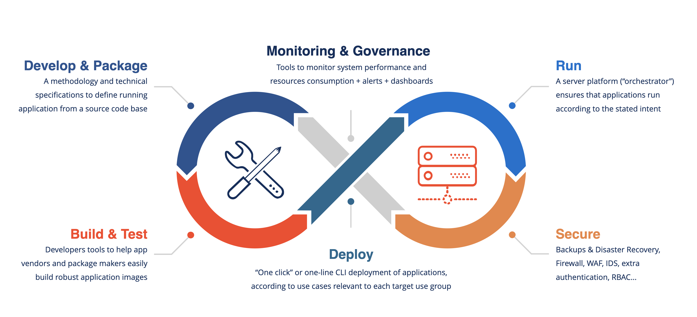

---

## What is Hop3: Today & Tomorrow

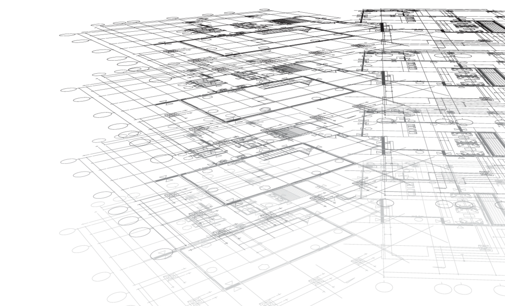

- **Today (Q2 2025):**
    - Single-server PaaS for F/OSS web apps.
    - `git push` deployment, `hop3.toml` declarative configuration.
    - OCI image builds (Docker concepts, flexible runtime) and "virtual environment" builds (more lightweight)
    - Growing catalog of easily deployable F/OSS applications.
- **Short-Term Roadmap (Q3-Q4 2025):**
    - Comprehensive multi-server, distributed application orchestration.
    - Advanced security, user management (SSO/RBAC), rich Web UI.
    - A vibrant application marketplace & active global community.
    - (Optional) Nix Integration: For Hop3 itself, app builders, reproducible environments, isolation.

---

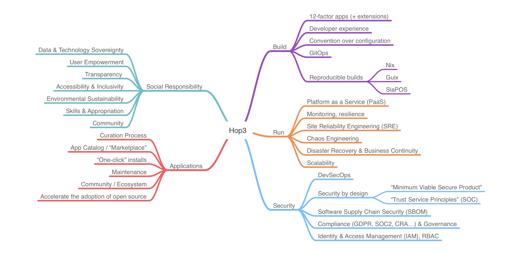

---

<!-- _class: invert -->
## Core Principles & Architecture

---

## Guiding Principles: The Hop3 DNA

- **12-Factor App Adherence:** Foundation for scalability, maintainability, resilience.
- **Beyond the 12 Factors:** Security-by-Design, Ethical Considerations, Sustainability.
- **Key Values Driving Development:**
    - Sovereignty, Security, Sustainability
    - Simplicity, Efficiency, Inclusivity
- **Lean & Agile:** Minimal dependencies for a robust, efficient platform.
- **Designed for Efficiency:** Runs on low-cost hardware, entry-level VPS; lightweight & energy-conscious.

---

## Architectural Overview: Tech Stack

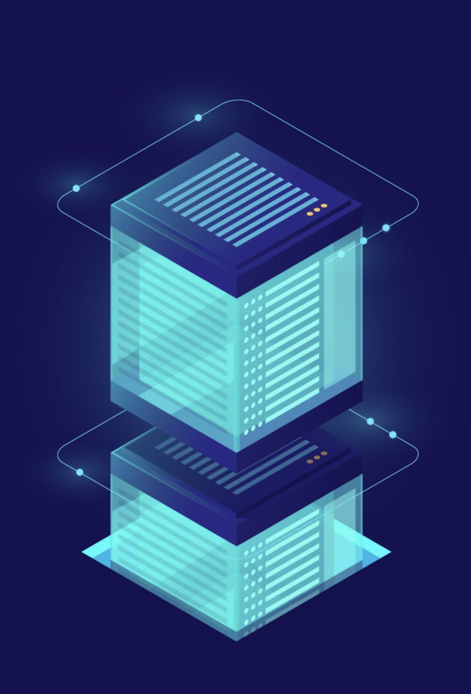

- **Primary Language:** Python 3.10+ (Robust, extensive ecosystem)
- **Runtime Agent:** Python also
- **Standard Tooling:** Leveraging OCI/Docker *concepts* for image building, Git, SSH. (Runtime is flexible, moving towards Nix)
- **Declarative Configuration:** `hop3.toml` (primary), Procfile compatibility.
- **Web UI (Hypermedia-Driven Approach):**
    - Backend: Flask, SQLAlchemy
    - Frontend: Tailwind CSS, Datastar (Modern, efficient)

---

## Lineage & Synergy: Piku & Nua

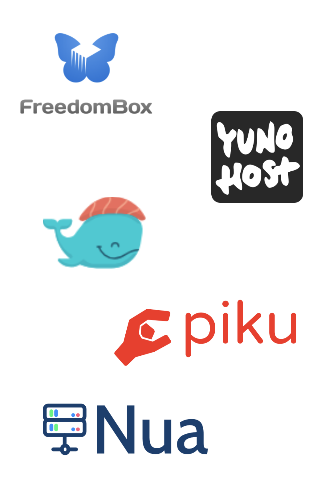

- **Inspiration:** FreedomBlox, YunoHost, Dokku, and especially Piku & Nua.
- **Building on Experience:** Reuses code and learnings from Piku & Nua (Abilian's 2021 PaaS).
- **Nua:** Was container-based, provided full lifecycle management.
- **Hop3's Distinct Approach:** Initially non-containerized for leanness, will integrate concepts and code from Nua to support containers; also, Nix tooling, as an alternative.
- **Synergistic Future:** Exploring future integrations, potentially merging strengths for a unified platform.

---

## Extensible Plugin Architecture

- **Core Design Philosophy:** Modular and plugin-based for ultimate flexibility.
- **Seamless Integration:** Easily adapt to new technologies, languages, and backing services.
- **Future-Proofing Hop3:** Ensures long-term adaptability and relevance, as well as community contributions.
- **Crucial for Ecosystems:** Key for supporting various build tools, runtimes, distributed external systems.

---

<!-- _class: invert -->
## Use Cases

---

## Hop3 in Action: Dogfooding & Vision

- **Internal Use (Dogfooding):**
    - ~12 websites, SaaS, customer apps at Abilian.
- **Future Vision:** Effortless deployment for complex apps:
  - **SDOs** (Software Developing Organisations): Streamline deployment workflows with GitOps and CI/CD, enabling efficient application lifecycle management and simplified infrastructure control.
  - **SMEs**: Reduce IT costs and maintain sovereignty by hosting essential applications (Digital Workspaces, CRMs, ERPs or e-commerce…), on a user-friendly, self-managed cloud platform.
  - **R&D Collaboration**: Hop3 provides an open, extensible platform with a modular architecture and plug-in system, making it ideal for collaborative experimentation with and advancing new approaches in cloud computing (orchestration, resource optimization, edge integration….).

---

## Key Features: Power & Simplicity

- **Simplified Configuration** (compared to, e.g., Kubernetes)
- **User Management & Access** (SSO, RBAC)
- **Automated Backups & Restore**
- **Monitoring & Logs**
- **Admin Processes**
- **Web Management Interface**
- **Multi-Technology Support:** Python, PHP, Node.js, Ruby, Go, Java, Rust...
- **Reproducible Builds** (Nix integration key)

(NB: some of these features are planned for the end of 2025).

---

<!-- _class: white -->
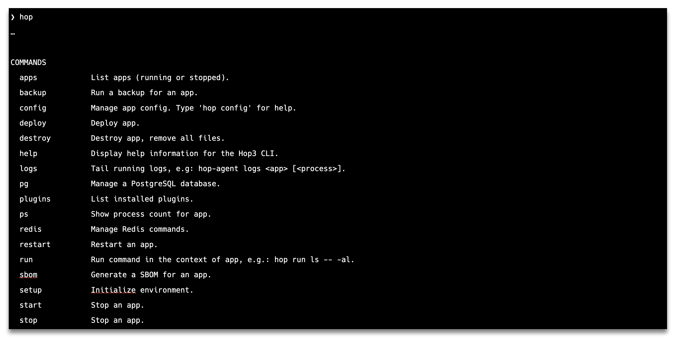

---

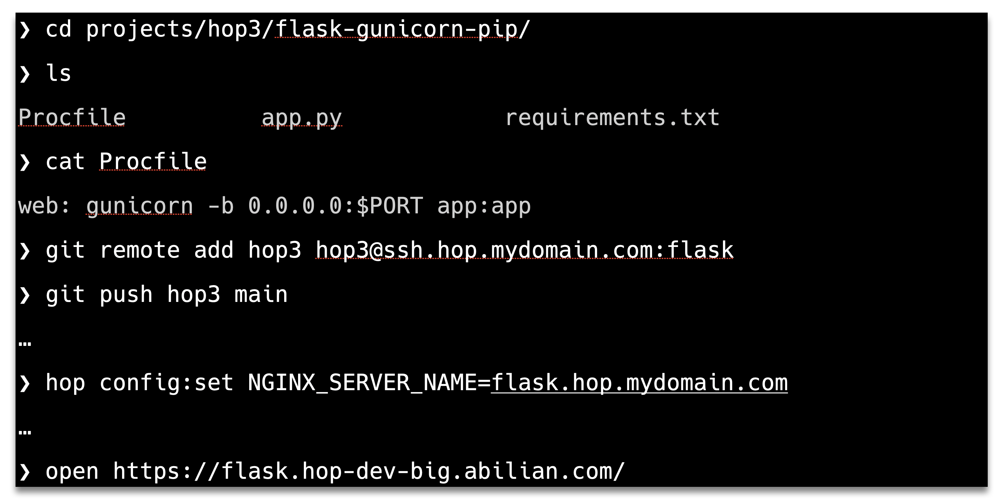

---

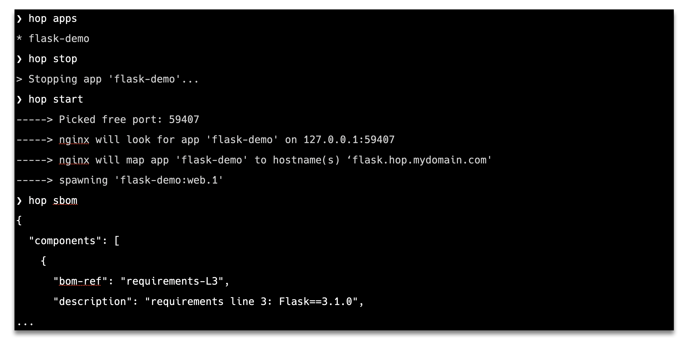

---
<!-- _class: invert -->
# Future Roadmap & Community

---

## Future Vision: Expanding Hop3

- **M3 / V1 MVP:** Full core platform services.
- **Runtime Integration:** Nix, SlapOS, Docker Swarm, Kubernetes, Nomad...
- **Scaling & Placement:** Vertical scaling, workload placement, multi-server.
- **Enhanced Security:** Firewall, WAF, better isolation (incl. VMs)
- **Broader Support:** Containers/VMs, Unified Login (LDAP/IAM), More base OSes.

---

## Project Backing & Status

- **Abilian:** Industrial R&D lab, F/OSS vendor (since 2012)
- **Funded By:**
    - Initial internal Abilian funding
    - [NGI Zero Commons Fund](https://nlnet.nl/commonsfund/)
    - [NEPHELE Project](https://nephele-project.eu/)
    - France2030 (via [HyperOpen X](https://hyperopenx.fr/))

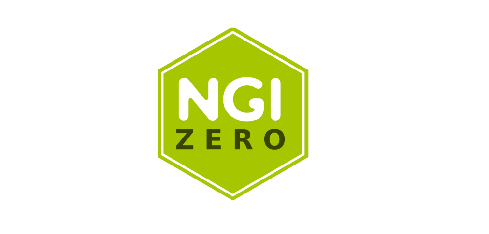

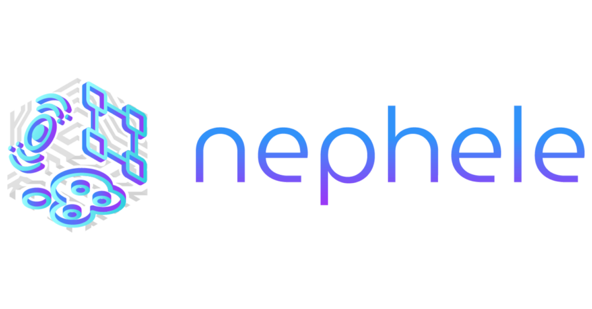

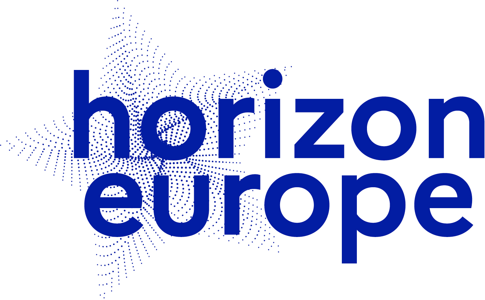

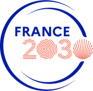

---

## NGI - Nix & Reproducible Builds

- **Deterministic Deployments:** Nix integration is KEY.
- **Goal:** Package apps in Nix as services.
    - Ambitious but high practical utility.
- **NGI0 Deliverable:** Fully functional Nix package for Hop3.
- **Simplifying NixOS:** Make it accessible for the "average office."

---

## NGI - Supply Chain Security

- **Software Supply Chain Security:** Top priority.
- **Automated SBOM Generation:**
    - CycloneDX format
    - Tools like Genealogos
- **Transparency & Verifiability:** For dependencies, compliance, audits.
- **REUSE Compliance:** For licensing clarity.

---

## NGI - Security By Design

- **Foundation: Secure Software Development Lifecycle (SSDLC):**
    - Threat modeling integrated into design phases.
- **Platform Hardening & Isolation:**
    - **Lean Runtimes:** Minimizing attack surface (-> Nix-based isolation goal).
    - **Principle of Least Privilege:** For all components and user access.
    - **Secrets Management:** Secure handling of sensitive credentials.
- **Network & Application Security:**
    - **Firewall & WAF:** Network-level firewall and Web Application Firewall (WAF) for ingress/egress control and threat prevention.
    - **Data Encryption at Rest:** For sensitive application data and backups.
- **Operational Security & Resilience:**
    - **Continuous Monitoring & Alerting:** For security events and anomalies.

---

## NEPHELE Integration (H3NI)

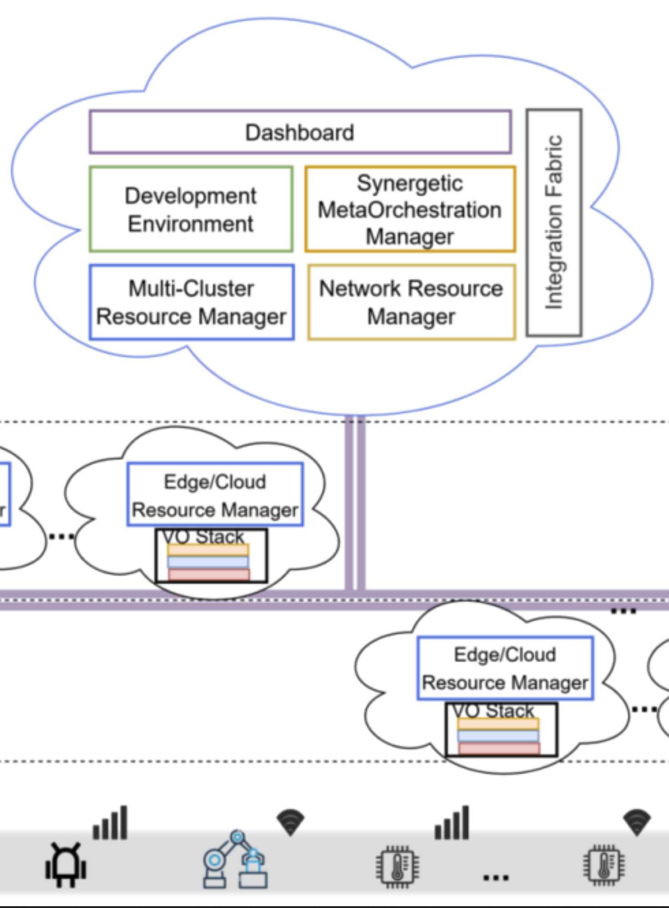

- **H3NI Project Focus:**
    - Leverage SMO for elasticity, workload consolidation.
    - Placement & Scaling provided by NEPHELE SMO.
- **SMO:** Synergetic Meta-Orchestrator (placement, scaling, monitoring, "glue" layer).
- **Integration:** SMO as a driver for Kubernertest deployments.
- **Contribution:** Testing/validation + Open-source mechanisms for SMO (orchestration, decision-making).

---

## Join Us! Open Source & Community

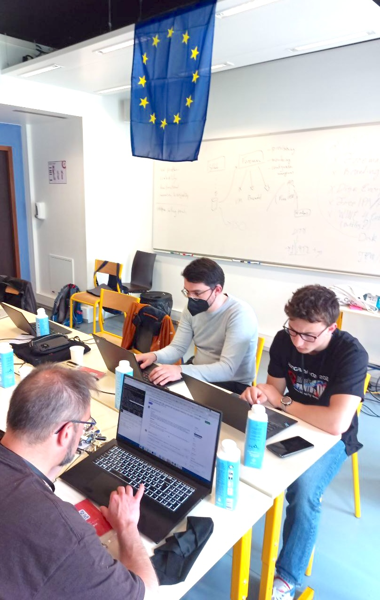

- **Fundamentally Open Source!**
- **Contributions Welcome:** Code, feedback, ideas.
- **Engage:**
    - Documentation, presentations (FOSDEM, PyCon, OSXP, OW2Con, etc.)
    - Website/blog, social media
    - Workshops, user groups
- **Hosted:** SourceHut & GitHub
- **Values:** REUSE compliance, PSF Code of Conduct.

---

## Find Hop3 Online

- **GitHub:**
    [github.com/abilian/hop3](https://github.com/abilian/hop3)

- **SourceHut:**
    [git.sr.ht/~sfermigier/hop3](https://git.sr.ht/~sfermigier/hop3)

- **Eclipse Research Labs:**
    [gitlab.eclipse.org/eclipse-research-labs/nephele-project/opencall-2/h3ni](https://gitlab.eclipse.org/eclipse-research-labs/nephele-project/opencall-2/h3ni)

- **Abilian:**
    [www.abilian.com](https://www.abilian.com)

- **Hop3:**
    [hop3.cloud](https://hop3.cloud/)

- **NGI0 Commons project:**
    [nlnet.nl/project/Hop3-Nixified/](https://nlnet.nl/project/Hop3-Nixified/)

---

<!-- _class: invert -->

# Key Takeaways & Impact

---

## Why Hop3 Matters

- **Viable Self-Hosting:** Open Source PaaS makes it accessible.
- **Digital Sovereignty:** Empowering users and organisations with infrastructure control.
- **F/OSS Ecosystem:** Simplifies deployment, fosters collaboration.
- **Champions:** Sustainability & Open Standards.
    - Cf. NGI's vision for an "Internet of Human Values - Resilient. Trustworthy. Sustainable."

---

## Key Takeaways

**Developers/DevOps:**
- ⚡ Quick dev deployments
- 🛡️ Manage production (backup, upgrades)
- 🚀 Easy `git push` / CLI workflows

**IT Managers:**
- 🏢 Deploy & manage F/OSS portfolio
- 🔑 Full control: infrastructure & data

**App Developers:**
- 🔧 Port apps to Hop3
- ⚙️ Leverage reproducible builds, simple config
- 📦 Packaging effort (Nix) valuable

**F/OSS Contributors:**
- 🗺️ Discover roadmap
- 🤝 Contribute to NGI0/NEPHELE funded project

<!--
Speaker notes:
For Developers/DevOps: Hop3 helps quickly deploy dev versions and manage production constraints like backup and upgrades, with easy git push or CLI workflows.
For IT Managers: Hop3 helps easily deploy and manage a portfolio of open source Web applications, providing full control over infrastructure and data.
For Application Developers: Learn how to port applications to Hop3 and leverage features like reproducible builds and simplified configuration. Note that packaging applications, potentially in Nix, is a key effort.
For Open Source Contributors: Discover Hop3's roadmap and how to contribute to an exciting project funded by NGI0 Commons and NEPHELE.
-->

---

<!-- _class: lead invert -->
<!-- _header: "" -->
<!-- _footer: "" -->

# Questions?

<!-- _class: lead invert -->

**Thank You!**

Stefane Fermigier
[sfermigier@abilian.com](mailto:sfermigier@abilian.com)
[abilian.com](https://www.abilian.com) | [github.com/abilian/hop3](https://github.com/abilian/hop3)

Financed, in part, by:

---

# Image credits

- https://www.freepik.com/free-photo/young-network-engineer-working-server-room_5819252.htm
- https://www.freepik.com/free-vector/data-network-businessman_5665337.htm
- https://www.freepik.com/free-photo/architectural-blueprints_1120523.htm
- https://www.freepik.com/free-vector/cloud-storage-database-isometric-server-room-personal-data-information-processing_3628738.htm
- https://www.freepik.com/free-vector/staff-management-perspective-definition-target-orientation-teamwork-organization-business-coach-company-executive-personnel-cartoon-characters_12084748.htm
- https://www.freepik.com/free-ai-image/pot-gold-end-rainbow_413065954.htm
- https://www.freepik.com/free-photo/businessman-looking-wavy-road_961566.htm
- https://www.freepik.com/free-vector/architecture-background-design_1004441.htm
- https://www.freepik.com/free-photo/wood-block-tower-game-children-parquet-background_27000780.htm
- https://www.freepik.com/free-vector/small-plant-design_894808.htm

- Image of EU OS hackathon used for illustration purpose only.

