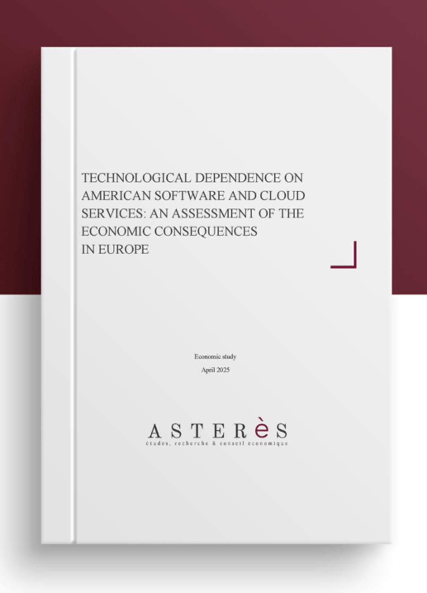

Of course. I will update the presentation to use the specific 20 propositions from the image for each of the five pillars. The overall structure and the two dedicated slides on defining "European Open Source" will be preserved as requested.

Here is the revised and finalized presentation deck.

---
marp: true
theme: gaia
size: 16:9
paginate: true
header: "The Open Source Way to Digital Sovereignty"
#footer: "© Abilian 2025 | Stefane Fermigier | Page %p / %P"
style: |
  section {
    font-size: 24px;
  }
  .columns {
    display: grid;
    grid-template-columns: repeat(2, 1fr);
    gap: 1rem;
  }
  .columns > ul, .columns > ol {
    margin-top: 0;
  }
  .logo-footer {
    display: flex;
    align-items: center;
    justify-content: center;
    height: 100%;
  }
  .logo-footer img {
    height: 40px;
    margin: 0 10px;
    background: white;
  }
  .small {
    font-size: 80%;
  }
  .white {
    background: white;
    --color-background: white;
  }
  p {
    text-align: left;
  }
  h1 {
    font-size: 2em;
  }
  h2 {
    font-size: 1.5em;
  }

---

<!--
class:
 - lead
header: ""
-->

# **The Open Source Way to  EU Digital Sovereignty &  Competitiveness**

### A Strategic Roadmap for Action

<i>Based on the July 2025 Report by the European Alliance for Industrial Data, Edge and Cloud</i>

---

<!--
class:
 - lead
header: ""
-->

# **Who am I?**

- Linux user since 1991
- Open Source advocate since 1998
- Open Source entrepreneur since 2000 (Nuxeo -> Abilian)
- Co-chair of CNLL, APELL
- Co-founder of EuroStack Initiative Foundation
- Member of the European Alliance for Industrial Data, Edge and Cloud, and co-author of the report

---

## **The Strategic Context: A Digital Crossroads**

Europe's digital infrastructure is increasingly built on technologies developed and controlled outside our borders. What was considered by many a merely technical issue has now become a major strategic vulnerability.

This dependency creates significant risks for our:
-   **Economic Autonomy**: Vulnerability to non-EU market dominance (€265 billion / year for cloud software and services from EU->US) .
-   **Data Security**: Exposure to extraterritorial laws like the FISA and CLOUD Act, exposing personal information (cf. GDPR) and strategic / corporate information and secrets.
-   **Strategic Independence**: A diminished ability to innovate according to our own values.

---

## **Defining Our Goal: Effective Digital Sovereignty**

To be truly sovereign, we need more than just control over data. The report starts from a simple and clear formula:

<b>Digital Sovereignty = Data Sovereignty + Technological Autonomy</b>

This means we must control the entire stack—the underlying hardware and software that manages our data. This technological independence is the key to effective sovereignty.

---

## **The Enabler: Why Open Source is the Cornerstone**

Initially (1998-2010) considered mostly as a cheaper alternative, Open Source has become for the last 15 years a fundamental pillar of the technological autonomy Europe seeks.

-   **Autonomy & Reversibility**
    It is the only real escape from vendor lock-in. Full control over the code guarantees the freedom to innovate independently.
-   **Collaboration & Innovation**
    It allows us to pool resources to build cutting-edge technologies that no single entity could develop alone.
-   **Transparency & Security**
    The ability to audit code allows for collective verification, vulnerability fixing, and ensures no hidden backdoors.

---

## **From Diagnosis to a Blueprint for Action**

To build a credible plan, we needed a deep diagnosis. Our analysis of Europe's digital landscape revealed a fundamental disconnect between our ambition for sovereignty and the reality of our ecosystem.

This diagnosis identified **5 critical "gaps"**. From these gaps emerged **70 concrete proposals**, each designed to address a specific weakness and build a stronger whole.

---

## **Gap 1: Standards & Interoperability**
### The Challenge of "Open Washing"

**The Problem**: Our ecosystem is fragmented by "standards" that are not genuinely designed to ensure interoperability and reversibility, promoted by non-EU players to maintain dominance. This creates vendor lock-in and stifles innovation.

**The Consequence**: A lack of genuine, enforceable interoperability that keeps Europe dependent and divided. Cf. the battle for EIFv2 (2009).

---

## **Gap 2: Financial Viability**
### The Peril of Instability

**The Problem**: Many critical European Open Source projects and businesses rely on sporadic funding, time-limited contracts and volunteer work. They lack resources for security audits, long-term maintenance, whole product development and professional support.

**The Consequence**: Key infrastructure components are unstable, uncompetitive, and at risk of being abandoned or acquired by non-EU interests.

---

## **Gap 3: Market Visibility & Adoption**
### The Fight for Recognition

**The Problem**: European Open Source solutions are often invisible, drowned out by the dominant marketing narratives of non-EU giants.

**The Consequence**: Public and private sectors alike default to non-sovereign solutions, not because they are better, but because they are better known.

---

## **Gap 4: Talent & Skills Shortage**
### The Human Capital Deficit

**The Problem**: The lack of expertise in sovereign Open Source technologies slows down innovation and implementation.

**The Consequence**: A persistent skills gap makes us reliant on foreign expertise, directly undermining our goal of technological autonomy.

---

## **Gap 5: Governance & Influence**
### The Imbalance of Power

**The Problem**: Europe contributes a vast amount of code to global Open Source projects (more than the US!) but exercises too little control over their strategic direction, which is often decided in foundations based outside the EU.

**The Consequence**: Key technological dependencies remain, as the roadmaps of critical software are not aligned with European strategic interests.

---

## **The Blueprint: A 5-Pillar Strategy to Bridge the Gaps**

Our 70 proposals are organized into a clear, actionable strategy built on five pillars. This is our roadmap for a sovereign digital future for Europe.

1.  **Technological Development**
2.  **Skills Development**
3.  **Public Procurement**
4.  **Growth and Investment**
5.  **Governance**

(Origin, in large part: previous proposals and reports from APELL, CNLL, OSBA, paliamentary reports, European projects, etc.)

---

## **Pillar 1: Technological Development**

**Objective**: To build a resilient technical foundation based on truly open standards and well-supported European projects.

**Strategic Actions**:
-   **Establishing EU-Wide Interoperability Standards**
    To create a cohesive digital market and fight vendor lock-in.
-   **Supporting Core Open Source Projects with Dedicated Funding**
    To ensure the stability and security of our foundational software.
-   **Developing and Promoting EU Reference Implementations for Open Source Infrastructure**
    To showcase excellence and provide practical blueprints for adoption.

---

## **Pillar 2: Skills Development**

**Objective**: To bridge the talent gap by fostering a skilled workforce proficient in European Open Source technologies.

**Strategic Actions**:
-   **Targeted Training Programs and Certifications**
    To provide the market with verifiably skilled professionals.
-   **Reskilling and Upskilling Initiatives for Industry Professionals**
    To adapt the existing workforce to meet new technological demands.
-   **Integrating Open Source... Topics into Education**
    To build a sustainable talent pipeline for the future.
-   **Promoting Open Source Business and Technical Skills in Vocational Training**
    To ensure practical, job-ready competencies.

---

## **Pillar 3: Public Procurement**

**Objective**: To leverage public spending as a powerful catalyst for the adoption of European Open Source solutions.

**Strategic Actions**:
-   **Prioritising EU Open Source in Public Procurement**
    To create demand and strategically invest public funds in our own ecosystem.
-   **Supporting Evaluation and Guidance for EU Open Source Solutions**
    To empower public bodies to make informed, sovereign choices.
-   **Leveraging Pre-Commercial Procurement for EU Open Source Development**
    To co-develop innovative solutions tailored to Europe's public sector needs.
-   **Establishing Guidelines and Best Practices for Public Sector Support**
    To ensure the long-term success of adopted solutions.

---

## **A Cornerstone Proposal: Defining "European Open Source"**

To make policies like "European Preference" effective, we must first have a clear, robust definition to prevent "open washing".

**Proposed Criteria for a "European Open Source" Solution:**

<ul>
<li><b>Origin of Development</b> A significant portion of R&D and development is conducted in Europe.</li>
<li><b>Governance</b> The project's governance is based in Europe and aligned with EU values.</li>
<li><b>Community</b> A substantial part of the user and contributor base is European.</li>
</ul>

<ul>
<li><b>Legal Framework</b> Uses OSI-approved licenses compatible with EU law.</li>
<li><b>Data Handling</b> Prioritizes data processing and residency within the EU, in compliance with EU laws and directives (like GDPR, but not only).</li>
<li><b>Ecosystem Contribution</b> The maintaining organization actively contributes back to the European ecosystem.</li>
</ul>

---

## **From Definition to Action: A New Procurement Principle**

Building on this definition, the report proposes a powerful new policy for public spending:

<h2>Public Money, Public Code,  Open Source First, <u>European Preference</u></h2>

This extends the well-known "Public Money, Public Code" initiative. The **"European Preference"** clause ensures that taxpayer-funded software not only remains open, but also **originates from and benefits the European Open Source ecosystem**.

It transforms public procurement from a simple purchase into a strategic investment in our own digital future.

---

## **Pillar 4: Growth and Investment**

**Objective**: To build a robust and sustainable funding ecosystem for the growth of European Open Source.

**Strategic Actions**:
-   **Mapping Investment Mechanisms and Incentives**
    To create a clear and accessible funding landscape.
-   **Early-Stage and Scale-Up Funding Programs**
    To support projects and businesses at every stage of their lifecycle.
-   **Establishing a European Open Source Brand**
    To build global recognition for the quality and trustworthiness of EU solutions.
-   **Supporting Public-Private Partnerships to Drive Innovation**
    To pool resources and expertise for high-impact projects.

---

## **Pillar 5: Governance**

**Objective**: To ensure the long-term security, sustainability, and European control of critical Open Source projects.

**Strategic Actions**:
-   **Conducting Vulnerability and Risk Analysis**
    To proactively secure our critical digital infrastructure.
-   **Aligning with Existing Compliance and Data Sovereignty Standards**
    To streamline adoption and ensure projects meet EU regulations like the CRA.
-   **Ensuring Long-Term Sustainability for Critical European Projects**
    To provide stable stewardship for foundational technologies.
-   **Enhancing Transparency and Community Engagement**
    To build trust and ensure governance reflects European values.

---

## **The Added Value: Transformative Impact on Key Sectors**

Implementing this roadmap will unlock concrete benefits across our society:

-   **Public Administration**
    Enhances security, transparency, and accountability while reducing dependency and lowering costs.
-   **Manufacturing (Industry 4.0)**
    Enables predictive maintenance, improves interoperability on the factory floor, and fosters innovation.
-   **Healthcare**
    Ensures patient data security, enables system interoperability, and accelerates medical research.
-   **Energy**
    Supports a greener future by optimizing grids, integrating renewables, and reducing data center energy use.

---

## **A Vision for Europe: A Virtuous Cycle of Sovereignty**

Implementing this roadmap will create a self-reinforcing cycle:

-   **Sovereign Infrastructure** will give us control over our digital destiny.
-   **A Thriving Ecosystem** will empower SMEs, create high-skilled jobs, and drive innovation.
-   **Reduced Dependency** will make our economy more resilient and secure.
-   **Technology Aligned with Our Values** will ensure that Europe's digital future is open, transparent, and human-centric.

---

# **Conclusion: A Call to Action**

Achieving European digital sovereignty requires the collective support and action of our entire ecosystem—from policymakers and industry leaders to developers and educators. Additional initiatives include:

- The "Cloud Sovereignty Framework" from the Commission
- Various public procurement initiatives (EU and MS)
- The EU-STF (European Sovereign Tech Fund) initiative
- APELL's "Digital Declaration of Independence" (contact me)
- Etc.

**Let's build our digital future, the Open Source way.**

Get the full report: <https://ec.europa.eu/newsroom/dae/redirection/document/117980>
