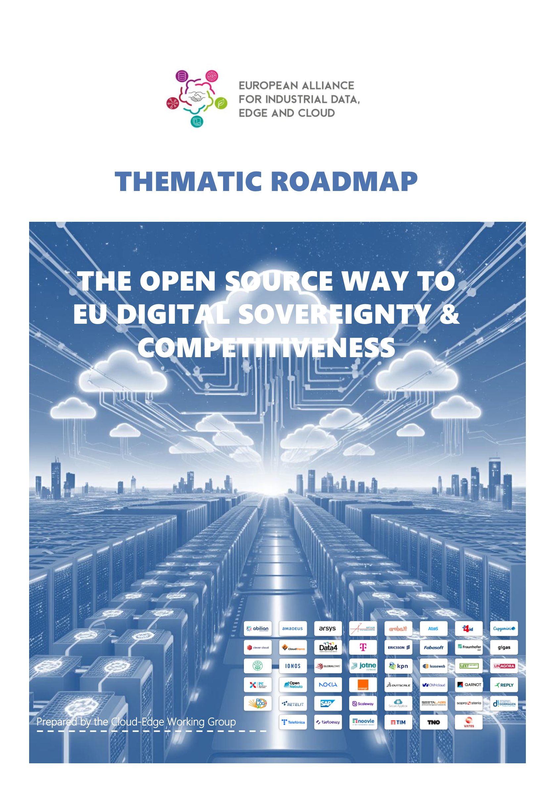

<!--
class:
 - lead
header: ""
-->

# **The Open Source Way to  EU Digital Sovereignty &  Competitiveness**

### A Detailed Roadmap for Action

<i>Based on the July 2025 Report by the European Alliance for Industrial Data, Edge and Cloud</i>

---

# **Part 1: The Strategic Imperative**

## Why Europe Must Act Now

This section outlines the foundational concepts and the urgent drivers behind the strategic push for digital sovereignty, powered by Open Source.

---

## **What is Digital Sovereignty?**

**"The capacity for autonomous assessment, decision-making, and action in the digital space.**"

To simplify, it is a combination of two key elements:

<b>Digital Sovereignty = Data Sovereignty + Technological Autonomy</b>

This means not only controlling our data but also the underlying hardware and software that manages it. This autonomy is essential for safeguarding Europe's operational independence.

---

## **Four Key Motivations Driving the Roadmap**

The report is driven by four urgent motivators for Europe:

1.  **Digital & Technological Sovereignty**
    Asserting control over our digital infrastructure and reducing reliance on non-EU technologies.

2.  **Data Security & Compliance**
    Safeguarding data and privacy with transparent, auditable solutions that comply with European laws like GDPR and the NIS Directive.

3.  **Innovation & Economic Resilience**
    Fostering a competitive and innovative market by lowering entry barriers for SMEs and promoting collaborative development.

4.  **Environmental Sustainability**
    Reducing the environmental footprint of digital infrastructure, in line with the European Green Deal.

---

## **Open Source: The Cornerstone of Sovereignty**

More than a matter of cost, Open Source is a fundamental enabler of technological sovereignty.

-   **Transparency & Security**
    The ability to audit the code allows for collective verification, finding and fixing vulnerabilities, and ensuring there are no hidden backdoors.
-   **Autonomy & Reversibility**
    It offers an escape from vendor lock-in. Full control over the code guarantees the freedom to adapt, modify, and innovate independently.
-   **Collaboration & Innovation**
    Open Source allows for pooling resources to build cutting-edge technologies that no single entity could develop alone, fostering a vibrant ecosystem.

---

# **Part 2: The Landscape & The Gaps**

## Europe's Current Position and Critical Challenges

This section assesses the current European Open Source ecosystem and identifies the five major obstacles hindering the achievement of digital sovereignty.

---

## **A Shared, Yet Challenged, European Ambition**

Digital sovereignty is a strategic goal for Europe, supported by key stakeholders, but significant challenges remain.

  <b>Key Initiatives:</b>
  <ul>
    <li><b>European Alliance for Industrial Data, Edge and Cloud</b>: A coalition of industry, Member States, and experts.</li>
    <li><b>Next Generation Internet (NGI)</b>: A European Commission program to build a more human-centric internet.</li>
    <li><b>IPCEI-CIS</b>: An "Important Project of Common European Interest" for Cloud Infrastructure and Services.</li>
  </ul>

  <b>The Reality:</b>
  
Despite these efforts, Europe's digital economy is heavily reliant on non-European entities. The IT market is still largely dominated by non-EU proprietary technologies, especially from US-based hyperscalers.

---

## **The 5 Critical Gaps Holding Europe Back**

The report identifies five interconnected gaps that prevent the full realization of a sovereign digital infrastructure.

1.  **Lack of open standards and interoperability**
2.  **Under-investment in critical software components**
3.  **Barriers to adoption (market, visibility)**
4.  **Shortage of talent and training**
5.  **Project governance often outside the EU**

Addressing these gaps requires the **70 concrete actions** proposed in the roadmap.

---

# **Part 3: The Roadmap for Action**

## The 5 Strategic Pillars and Key Proposals

This section details the core of the roadmap: a five-pillar strategy with actionable recommendations to build a sovereign, resilient, and competitive digital Europe.

---

## **The 5 Strategic Pillars of the Roadmap**

The 70 proposals are organized across five pillars, forming a comprehensive strategy for action:

- **Pillar 1: Technological Development**
  Build a solid foundation on open, interoperable standards.

- **Pillar 2: Skills Development**
  Train the talent needed to build and maintain the ecosystem.

- **Pillar 3: Public Procurement**
  Use public purchasing power as a strategic lever for change.

- **Pillar 4: Growth and Investment**
  Create a sustainable funding environment for European Open Source.

- **Pillar 5: Governance**
  Ensure the long-term sustainability and European control of critical projects.

---

## **Pillar 1: Technological Development**

**Objective**: To build a resilient technical foundation based on truly open standards and well-supported European projects.

**Key Actions**:
1.  **Establish & Enforce TRULY Open Standards**
    -   Develop European-governed specifications and reference architectures to fight "open washing" and ensure genuine interoperability.
2.  **Fund Critical Open Source Projects**
    -   Create a **"European Open Source Sovereignty Fund" (EOSSF)** to provide stable, long-term funding for essential infrastructure components.
3.  **Promote EU Reference Implementations**
    -   Develop sector-specific "playbooks" and large-scale demonstration projects (e.g., in healthcare, public administration) to showcase European excellence.

---

## **Pillar 2: Skills Development**

**Objective**: To bridge the talent gap by fostering a skilled workforce proficient in European Open Source technologies.

**Key Actions**:
1.  **Launch Targeted Training & Certifications**
    -   Create industry-recognized certifications for European Open Source technologies, focusing on practical, hands-on skills.
2.  **Invest in Reskilling & Upskilling**
    -   Fund programs to help IT professionals transition to roles in the European Open Source ecosystem.
3.  **Integrate Open Source into Education**
    -   Incorporate Open Source principles into STEM curricula and establish "Centres of Excellence" at universities.

---

## **Pillar 3: Public Procurement**

**Objective**: To leverage public spending as a powerful catalyst for the adoption of European Open Source solutions.

**Key Actions**:
1.  **Adopt "Public Money, Public Code, European Preference"**
    -   Mandate that taxpayer-funded software originates from and benefits the European Open Source ecosystem.
2.  **Develop Clear Procurement Guidelines**
    -   Provide resources for public bodies to evaluate and select sovereign Open Source solutions, focusing on total cost of ownership (TCO) and avoiding vendor lock-in.
3.  **Use Pre-Commercial Procurement (PCP)**
    -   Co-develop innovative solutions with European SMEs to address specific public sector needs.

---

## **Pillar 4: Growth and Investment**

**Objective**: To build a robust and sustainable funding ecosystem for the growth of European Open Source.

**Key Actions**:
1.  **Create a Centralized Investment Platform (EOSIP)**
    -   Develop a one-stop-shop platform consolidating information on grants, loans, and venture capital for European Open Source projects.
2.  **Establish a "European Open Source Brand"**
    -   Launch a branding initiative to promote the quality, security, and reliability of sovereign European solutions on the global stage.
3.  **Foster Public-Private Partnerships (PPPs)**
    -   Incentivize private sector investment in critical Open Source projects through co-investment programs and R&D consortia.

---

## **Pillar 5: Governance**

**Objective**: To ensure the long-term security, sustainability, and European control of critical Open Source projects.

**Key Actions**:
1.  **Conduct Proactive Risk & Vulnerability Analysis**
    -   Partner with EU cybersecurity agencies to assess critical projects and reduce dependency on non-EU components.
2.  **Align with Existing EU Regulations**
    -   Provide guidance to help European projects navigate and comply with frameworks like the Cyber Resilience Act (CRA) and GDPR without undue burden.
3.  **Strengthen European Leadership**
    -   Establish a **European Open Source Advisory Board** to oversee funding, promote best practices, and ensure critical projects remain under European stewardship.

---

# **Part 4: The Added Value & Vision**

## The Tangible Benefits and a Framework for the Future

This section highlights the concrete benefits of implementing the roadmap across key sectors and introduces a framework for evaluating true sovereignty.

---

## **Transformative Impact on Key Sectors**

Adopting European Open Source solutions will unlock significant benefits:

-   **Public Administration**
    Enhances security, transparency, and accountability while reducing dependency on non-EU providers and lowering costs.
-   **Manufacturing (Industry 4.0)**
    Enables predictive maintenance, improves interoperability on the factory floor, and fosters a culture of innovation.
-   **Healthcare**
    Ensures patient data security and privacy, enables interoperability between systems, and accelerates medical research through secure collaboration.
-   **Energy**
    Supports a greener future by optimizing energy grids, integrating renewables, and reducing the energy consumption of data centers.

---

## **"LOTEC" Criteria for Effective Sovereignty**

To assess and ensure true digital sovereignty, the report proposes a multi-dimensional evaluation framework (work in progress):

<ul>
  <li><b>L - Legal</b>: Immunity from non-EU laws (e.g., CLOUD Act). The supplier and its beneficial owners must be under EU jurisdiction.</li>
  <li><b>O - Operational</b>: Control of operations (admin, support) by European personnel located in Europe.</li>
  <li><b>T - Technological</b>: Transparency, interoperability, and reversibility guaranteed by <b>Open Source</b> and open standards.</li>
  <li><b>E - Economic</b>: Value creation (R&D, jobs) primarily in Europe with fair business models.</li>
  <li><b>C - Cultural & Ethical</b>: Alignment with European values and diversity.</li>
</ul>

---

# **Conclusion: A Call to Action**

European digital sovereignty is not a distant goal—it is an urgent necessity that can be achieved through collective, strategic action. **Open Source is Europe's greatest asset in this endeavor.**

The time for decisive action is now.

Get the full report: <https://ec.europa.eu/newsroom/dae/redirection/document/117980>
